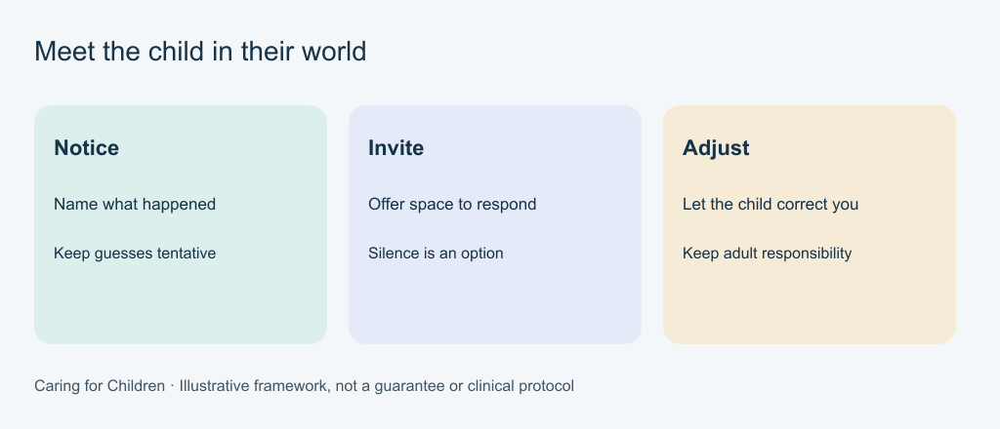
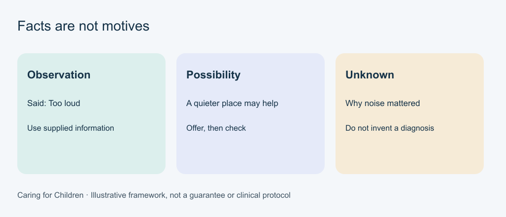
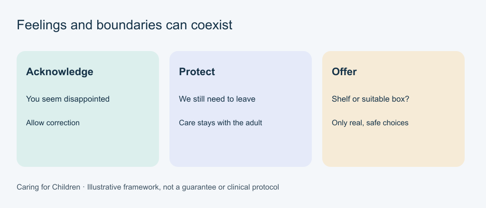
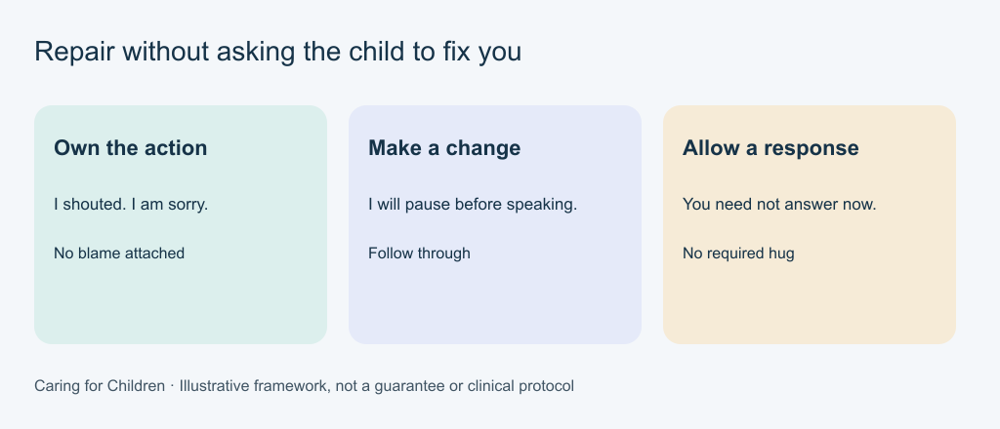
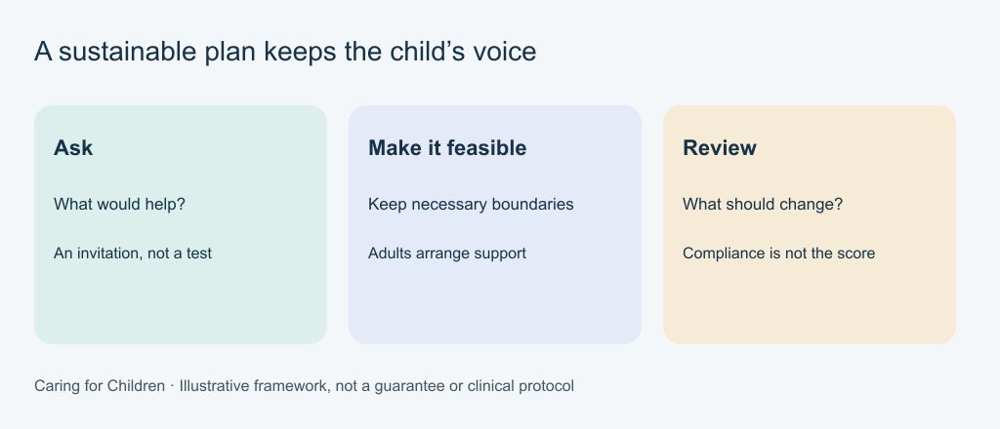

# Diagrams and text equivalents

[Course home](README.md)

Six original code-drawn diagrams, prepared with AI assistance for this course. No third-party photographs, logos or illustrations are included. SVG originals and PNG renderings carry the course [licence](LICENSE.md), to the extent rights are held. These illustrate editorial frameworks, not measured outcomes or clinical protocols. Text equivalents below contain all instructional information.

## Meet the child in their world

Text equivalent: Notice: Name what happened; Keep guesses tentative. Invite: Offer space to respond; Silence is an option. Adjust: Let the child correct you; Keep adult responsibility.

[Editable SVG](images/world.svg)

## Facts are not motives

Text equivalent: Observation: Said: Too loud; Use supplied information. Possibility: A quieter place may help; Offer, then check. Unknown: Why noise mattered; Do not invent a diagnosis.

[Editable SVG](images/facts.svg)

## Feelings and boundaries can coexist

Text equivalent: Acknowledge: You seem disappointed; Allow correction. Protect: We still need to leave; Care stays with the adult. Offer: Shelf or suitable box?; Only real, safe choices.

[Editable SVG](images/limits.svg)

## Repair without asking the child to fix you

Text equivalent: Own the action: I shouted. I am sorry.; No blame attached. Make a change: I will pause before speaking.; Follow through. Allow a response: You need not answer now.; No required hug.

[Editable SVG](images/repair.svg)

## Different ages need different care

Text equivalent: Understand needs: Age is a starting point; Attend to the individual. Choose suitable care: Infant sleep is distinct; Use current guidance. Get specific help: Health concerns need care; No universal prescription.

[Editable SVG](images/care.svg)

## A sustainable plan keeps the child’s voice

Text equivalent: Ask: What would help?; An invitation, not a test. Make it feasible: Keep necessary boundaries; Adults arrange support. Review: What should change?; Compliance is not the score.

[Editable SVG](images/voice.svg)