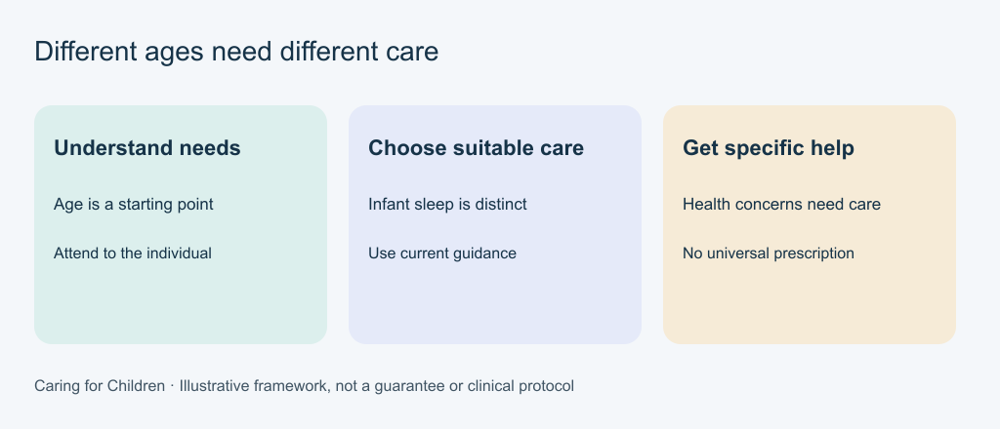

# 8. Support daily care

[Course home](../README.md) · [Curriculum](../CURRICULUM.md)

## Objective

Distinguish general routines from age-specific and individual care needs.

## Explanation

Daily care is not a single checklist for every age. Adults organize safe access to food, hygiene and rest; children can participate in ways they can manage.

| Area | General starting point | Important limit |
|---|---|---|
| Food | Offer a calm meal and suitable choices; avoid a contest over eating. | Infant feeding and swallowing, allergy or growth concerns need appropriate health guidance. |
| Hygiene | Explain the task, offer manageable participation and preserve privacy. | Young children need help with toothbrushing; use dental guidance for their needs. |
| Rest | Build a predictable wind-down suited to the child's age. | An older child's bedtime setup is not a safe infant sleep plan. |

CPS guidance covers [feeding](https://caringforkids.cps.ca/handouts/healthy-living/when_your_child_is_a_picky_eater), [teeth](https://caringforkids.cps.ca/handouts/healthy-living/healthy_teeth_for_children) and [sleep](https://caringforkids.cps.ca/handouts/healthy-living/healthy_sleep_for_your_baby_and_child). These starting points are not dietary prescriptions or treatment.

For babies, Health Canada advises back placement for sleep on a firm, flat, clear surface in a compliant crib, cradle or bassinet. Keep pillows, soft toys and loose bedding out. Read the full [safe sleep guidance](https://www.canada.ca/en/health-canada/services/safe-sleep/safe-sleep-tips.html); this short note is not the complete guidance.

Text equivalent: Understand needs: Age is a starting point; Attend to the individual. Choose suitable care: Infant sleep is distinct; Use current guidance. Get specific help: Health concerns need care; No universal prescription.

## Worked example

Fictional: an adult offers a young child a choice of two suitable toothbrushes and helps with brushing. They do not assume choosing a brush means the child can clean their teeth unaided. Persistent pain is a reason to seek dental care, not increase pressure.

## Practice

Fictional: someone proposes moving an older sibling's pillows and stuffed toys into a baby's crib “for comfort.” What is wrong with using the same routine? Also identify what is missing from “all children should eat the same meal.”

## Answers and checking

Infant sleep safety is distinct: soft objects must not be added to the baby's sleep space. Check the complete Health Canada guidance. The meal statement omits age, allergies, feeding abilities and individual care needs. No universal menu follows from this course.

## Try independently

Create a fictional wind-down with two feasible choices for a school-age child. Keep it separate from infant sleep advice; do not promise it will solve a sleep problem.

[Previous](07-overwhelm.md) · [Next](09-privacy.md)