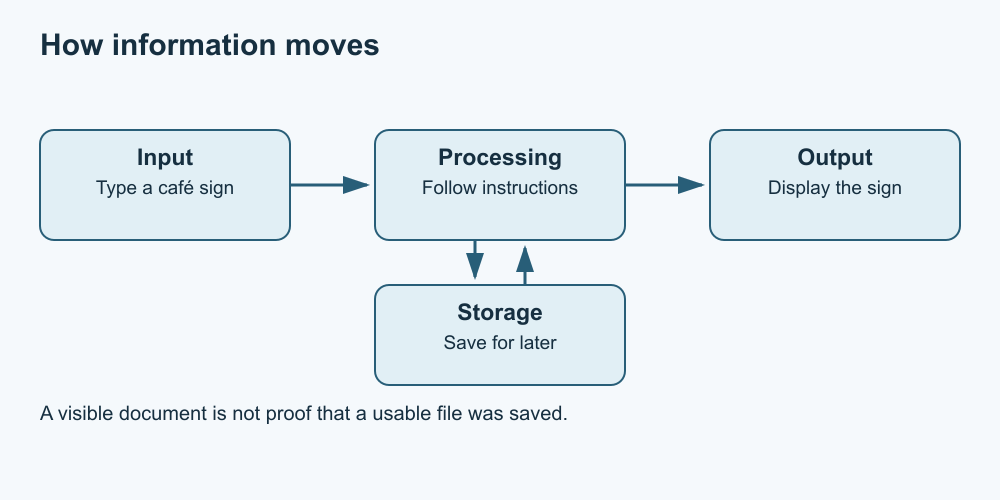

# 1. What a computer does

[Course home](../README.md) · [Curriculum](../CURRICULUM.md) · [Glossary](../GLOSSARY.md)

**Objective:** Explain input, processing, output and storage using an everyday task.

A computer works with instructions and information. A keyboard, microphone or sensor can supply input. A processor carries out operations. A screen, speaker or other device presents output. Storage keeps information for later use. These are roles: a touchscreen can provide both input and output.

Consider an invented café sign. You type “Open at 10”; an application uses the keyboard input to update a document; the screen shows the words. Saving writes a file to a chosen storage location. Seeing words on screen is not enough to prove a usable file has been saved.

Working memory, often called RAM, holds information needed while programs run. Storage is used to keep files beyond that moment. This is a simplified distinction: devices and applications may manage temporary files and recovery data differently. Do not rely on an open window as your only copy.

*An authored conceptual diagram, not a wiring diagram. Text equivalent: input enters processing; processing produces output and can read or write storage.*

A computer does not decide that your café opening time is correct. It can display a typo accurately. You remain responsible for checking the information you enter.

## Practise

On paper, draw four boxes labelled Input, Processing, Output and Storage. For a fictional shopping list, put each event in the right box: typing “apples”, displaying the line, arranging the words alphabetically, and saving the list. Then explain what you would check before closing the application.

## Suggested reasoning

Typing is input; sorting is processing; the displayed line is output; the saved file is storage. Before closing, identify the intended file and location and use the application's save process. Reopening the intended file later is stronger evidence of saving than just seeing the original window.

## Try a new situation

Explain the four roles for playing a saved song. Which device gives output, and where might the music file be stored?

## Sources and limits

This lesson uses standard introductory concepts and original fictional examples. Product-specific saving is discussed in [lesson 5](05-save.md).

[Next lesson](02-parts.md)
