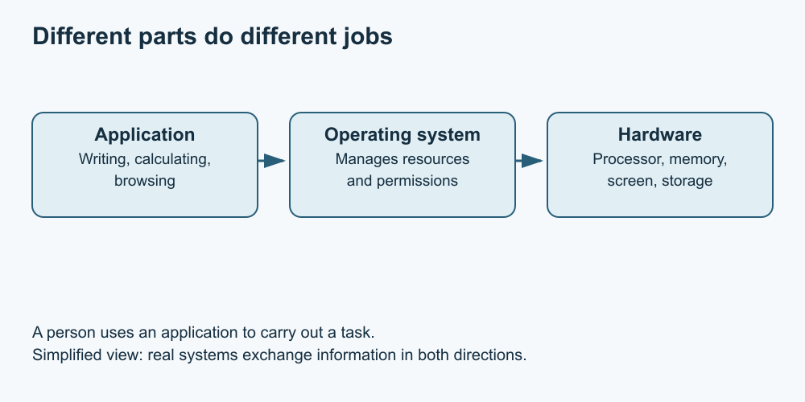

# 2. Hardware, software and the operating system

[Course home](../README.md) · [Curriculum](../CURRICULUM.md) · [Glossary](../GLOSSARY.md)

**Objective:** Distinguish physical components, applications and the operating system.

Hardware is physical equipment: a screen, keyboard, processor or storage drive. Software consists of instructions and related data. An application helps with a task such as writing, calculating or viewing a picture. The operating system coordinates resources and provides services that applications use.

Think of layers rather than competing names. A writing application uses operating-system services to work with files, which are stored using hardware. A problem at one layer can appear at another: a disconnected display is different from an application showing an empty document.

*Simplified layers. Text equivalent: person → application → operating system → hardware. Real systems have additional layers and two-way interactions.*

A laptop and a desktop are both computers. A tablet or phone is also a computer, although its controls and software may differ. More expensive equipment is not automatically the right equipment for your task. Begin with what you need to do and what you can already access.

Do not open a case, remove a battery or unplug unfamiliar equipment for this course. You can learn the distinctions by observing the outside or using labelled drawings.

## Practise

Classify these fictional inventory entries: keyboard, Windows, a spreadsheet application, a monitor, a saved budget file. Explain which ones are hardware, which are software, and which is user data. Then name one question to ask before using a shared computer.

## Suggested reasoning

Keyboard and monitor are hardware. Windows is an operating system; the spreadsheet is an application. The budget file is user data, interpreted by suitable software. On a shared machine, ask who owns it and which tasks or locations you may use. Having access does not grant permission to change it.

## Try a new situation

A picture will not open. Name one possible file problem, one application problem and one hardware problem. These are possibilities to investigate, not diagnoses.

## Sources and limits

These are general concepts. No particular hardware model, purchase or repair procedure is recommended.

[Previous lesson](01-computer.md) · [Next lesson](03-navigation.md)
