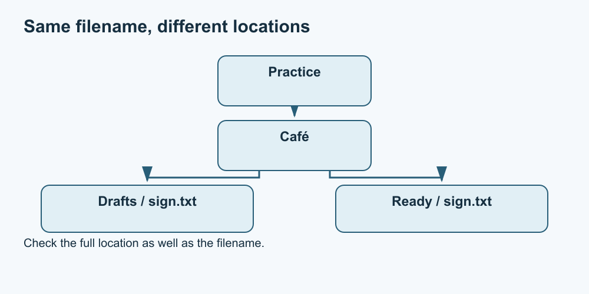

# 4. Files, folders and locations

[Course home](../README.md) · [Curriculum](../CURRICULUM.md) · [Glossary](../GLOSSARY.md)

**Objective:** Describe a file using its name, format and location.

A file is a stored unit of information. A folder organises files and other folders. The same name can exist in different folders, so a name alone may not identify the intended file. A path describes its location.

In the fictional tree below, Drafts and Ready each contain a file called sign.txt. They are separate locations. “Open sign.txt” is ambiguous unless you know which one.

*Text equivalent: Practice → Café → Drafts → sign.txt; Practice → Café → Ready → sign.txt. This is an invented folder arrangement.*

An extension, such as .txt or .png, is part of a file name that commonly indicates a format. An application must be able to interpret the actual contents. Renaming photo.png to photo.txt does not convert a picture into a text document.

Windows 11 File Explorer can show extensions through View → Show → File name extensions. This is a documented option, not a required settings change. Icons, shortcuts and recent-file lists can be useful, but check the location rather than guessing from an icon.

Copying makes another instance; moving changes location. A shortcut points to something else. These are different actions. We use copies and new practice material in this course, not moves of important files.

## Practise

On paper, create folders called Drafts, Ready and Reference. Place three fictional file cards: invitation.txt, map.png and source-notes.txt. Explain your arrangement. Now put another invitation.txt in Reference and say how to distinguish it from the draft.

## Suggested reasoning

Several arrangements work if the purpose is clear. The two invitation files are distinguished by their complete locations. A meaningful name such as invitation-draft.txt can help, but it does not replace checking the folder. Do not change an extension merely to make a file open.

## Try a new situation

Someone sends “the latest budget.” What details would help identify it? Consider name, location, modification context and whether you have the right version.

## Sources and limits

[Microsoft File Explorer guidance](https://support.microsoft.com/en-us/windows/experience/fileexplorer/file-explorer-in-windows); [file extensions](https://support.microsoft.com/en-US/Windows/Experience/Storage-FileManagement/common-file-name-extensions-in-windows).

[Previous lesson](03-navigation.md) · [Next lesson](05-save.md)
