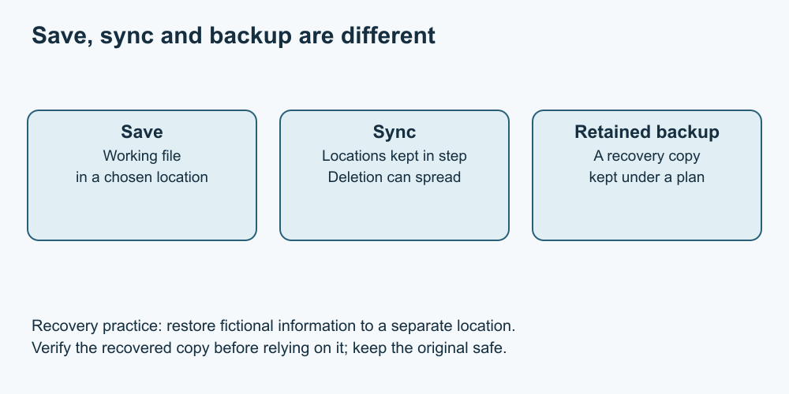

# 8. Saving, syncing and backing up

[Course home](../README.md) · [Curriculum](../CURRICULUM.md) · [Glossary](../GLOSSARY.md)

**Objective:** Explain what a recovery copy protects against and check it without deleting the original.

Save records work in a file. Sync keeps selected locations in agreement; changes, including some deletions, can propagate. A backup preserves a recoverable copy according to its settings, scope and retention. A service may combine these functions, so learn what it actually retains.

A second folder on the same drive can help practise copying, but it does not protect against that drive failing. Nor does seeing a cloud icon prove that a file is available offline or recoverable indefinitely. Check the copy and recovery method.

*Text equivalent: saving updates the working file; sync can propagate updates or deletion; a separately retained backup can supply a recovered copy. These are concepts, not a guarantee about any product.*

For example, Microsoft documents that deleting a OneDrive item can remove it from OneDrive and connected locations. Recovery depends on the applicable service and retention. This lesson deliberately gives no universal recovery deadline.

Get Cyber Safe recommends keeping backup copies and disconnecting external backup storage when copying is complete. Real setup choices need the owner's permission and appropriate protection for private data. No device purchase or backup-service setup is required here.

## Practise

Paper route: copy a fictional note onto a second card marked “saved at 10:00”. Change the original at 11:00. Compare which version the copy contains. Explain what would happen if both cards were lost together.

Optional device route: using only lesson 5's practice file, copy it into a new practice folder and open the copy to compare text. Label this a copying demonstration, not a complete backup. Keep the original. Never delete a real file to test recovery.

## Suggested reasoning

The retained copy represents the 10:00 version, not necessarily the latest work. Losing both copies together defeats recovery. A successful test checks readable contents and identifies what is missing; it does not prove all files are protected. A same-drive practice copy is not protection against drive failure.

## Try a new situation

Describe a recovery check that creates a separate restored copy without overwriting the current file. What permissions and location information would you need?

## Sources and limits

[Get Cyber Safe: storage and backup](https://www.getcybersafe.gc.ca/en/secure-your-devices/storage-and-backup); [Microsoft: OneDrive deletion](https://support.microsoft.com/en-us/onedrive/delete-files-or-folders-in-onedrive).

[Previous lesson](07-accounts.md) · [Next lesson](09-troubleshooting.md)
