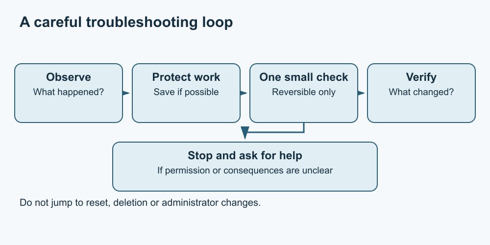

# 9. Troubleshoot without making things worse

[Course home](../README.md) · [Curriculum](../CURRICULUM.md) · [Glossary](../GLOSSARY.md)

**Objective:** Describe a problem and choose a small, reversible next step.

A useful problem description says what you expected, what happened and what you were doing. “It is broken” gives less help than “I opened the practice folder, but reading-table.txt was not there.”

Start with observations. Check the current window, file location and exact message. A missing file might be in another folder; it is not proof that a drive failed. Change one thing at a time so you can tell what made a difference.

*Text equivalent: observe → protect work → try one permitted reversible check → verify. If uncertain, unsafe or unchanged, stop and ask for help.*

Before closing an application, consider unsaved work. Rebooting, resetting, reinstalling, deleting files and turning off protections are not automatic first steps. This course does not direct those actions. If you encounter signs of physical damage, electrical danger or a serious security incident, stop ordinary troubleshooting and seek appropriate help.

Share only what is needed. A screenshot may include private names, documents or notifications. You can often type a short error message without submitting the full screen. Never include passwords or recovery codes.

## Practise

Fictional scenario: you expected the saved invitation in Drafts, but File Explorer is showing Downloads. Write one reversible check and a short support request if it does not help.

Use this structure: task; expected result; observed result; exact harmless message; checks already tried; assistance requested. Do not invent checks you did not perform.

## Suggested reasoning

First navigate to the recorded Drafts location without moving or deleting anything. If the file is absent, report the two locations checked and ask for help locating the practice file. Avoid saying it was deleted unless evidence supports that. A good report separates observations from guesses.

## Try a new situation

An application repeatedly reports that access is denied. Explain why trying random administrator changes is a poor next step, and write a question for the responsible owner.

## Sources and limits

This is an original decision framework, not a vendor repair procedure. For an actual product fault, use its current official support route; [source notes](../SOURCES.md) explain the limits.

[Previous lesson](08-backups.md) · [Next lesson](10-project.md)
