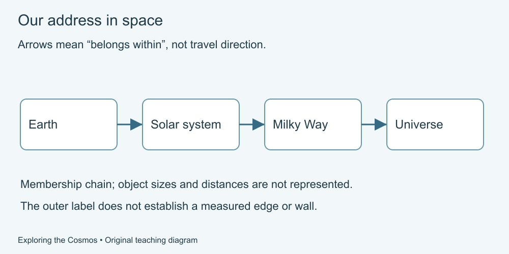

# Exploring the Cosmos

Explore our place in space, learn how light carries evidence, and practise asking what a discovery claim actually establishes.

For **adult beginners, 18+**. This is an editorial audience choice, not tested age suitability. No previous course, telescope, installation, purchase or AI account is required.

## Start learning

1. [Our address in space](lessons/01-address.md)
2. [Size, distance and time](lessons/02-scale.md)
3. [Motion and gravity](lessons/03-motion.md)
4. [Meet the solar system](lessons/04-solar-system.md)
5. [The Sun and other stars](lessons/05-stars.md)
6. [Learning from light](lessons/06-light.md)
7. [Galaxies and cosmic history](lessons/07-history.md)
8. [Worlds beyond our solar system](lessons/08-other-worlds.md)
9. [Open questions and space claims](lessons/09-claims.md)
10. [Build a space explanation](lessons/10-project.md)

Each lesson includes an explanation, worked example, practice, suggested reasoning and a new situation. Start at lesson 1 or use the [curriculum](CURRICULUM.md) to choose a topic.

Text equivalent: Earth is part of the solar system; our solar system is within the Milky Way galaxy; galaxies are part of the universe. The diagram does not measure a boundary or a distance.

## What you will practise

Read a scale, distinguish rotation from orbit, interpret a toy spectrum, compare percentage drops and write an explanation that separates evidence from assumptions. The final project supplies two fictional exhibits; no observation equipment or outdoor activity is needed.

All core activities work on paper or an accessible equivalent. A calculator is optional. Do not look at the Sun or use improvised filters for this course; no solar observation is assigned. Diagrams are teaching models, not telescope photographs. Fictional data and arbitrary units are labelled.

## Supporting material

- [Curriculum and learning route](CURRICULUM.md)
- [Glossary](GLOSSARY.md)
- [Facilitator guide and rubric](FACILITATOR-GUIDE.md)
- [Developer reuse guide](DEVELOPER-GUIDE.md)
- [Scientific sources and dates](SOURCES.md)
- [Illustration provenance](ASSET-SOURCES.md)
- [Free reuse terms](LICENSE.md)

This is general education, not a professional qualification, observation manual or guarantee of scientific discovery. No learner pilot, independent scientific review or formal accessibility assessment has been performed.

For general corrections, use [GitHub Issues](https://github.com/Green-Web-Land/Essential-for-Life/issues). Keep private information out of public reports.

[Essential Knowledge for Life](../../README.md)
