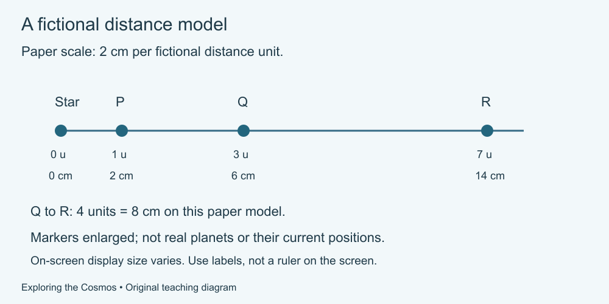

# 2. Size, distance and time

[Course home](../README.md) · [Glossary](../GLOSSARY.md)

**Goal:** Use a stated scale and distinguish length from elapsed time.

Adults 18+. All invented records and model numbers are labelled. Work on paper or an accessible equivalent; calculator optional.

## Understand

A kilometre measures length; a year measures time. A light-year is a length: the distance light travels in vacuum in one year. Its name does not make it a unit of age. NASA gives approximately 9.46 trillion kilometres per light-year; we use the definition here without treating rounded values as exact.

Powers of ten make large quantities easier to compare: 10³ means 1,000 and 10⁶ means 1,000,000. Keep units beside values.

A drawing may represent distances accurately while enlarging object symbols. Read both the distance scale and the size note. A distance measured from a reference star is not necessarily the gap between two objects.

Text equivalent: Fictional P, Q and R lie 1, 3 and 7 units from the star, drawn at 2, 6 and 14 cm using 2 cm per unit. Marker sizes are not to scale.

## Worked example

In a fictional model, one distance unit is drawn as 2 cm. An object 3 units from the star is placed 6 cm from the star: 3 × 2 = 6. The model supplies no physical meaning such as kilometres for its invented unit.

## Practise

Place objects P, Q and R at distances 1, 3 and 7 fictional units along one straight line from the star. Use 2 cm per unit. Calculate each position and the Q-to-R gap. Why cannot symbol diameter establish planet size?

## Suggested reasoning

Positions are 2, 6 and 14 cm. The Q-to-R gap is 14 − 6 = 8 cm, representing 4 fictional units. Symbols are enlarged location markers, not measured diameters. This straight-line arrangement is invented, not a picture of current planetary positions.

## Try a new situation

At 1 cm per unit, what changes? Check: positions become 1, 3 and 7 cm and the Q-to-R gap becomes 4 cm. The represented distances are unchanged.

[Source notes](../SOURCES.md) · [Next lesson](03-motion.md) · [Reuse](../LICENSE.md)
