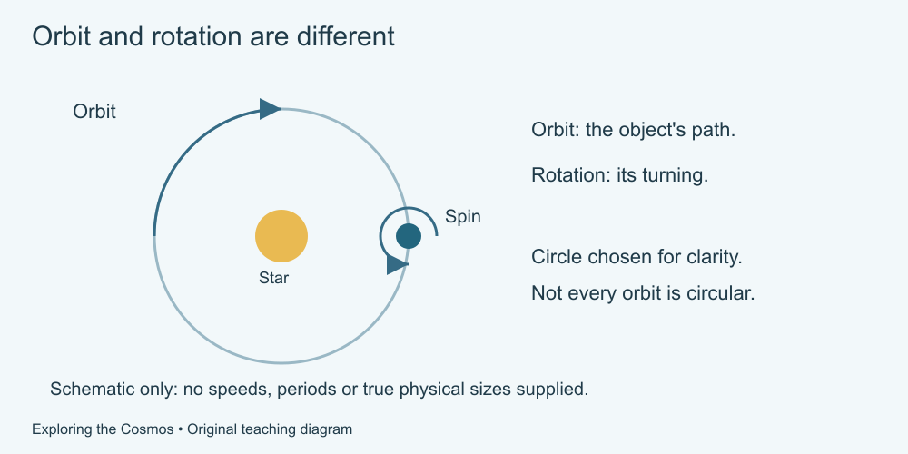

# 3. Motion and gravity

[Course home](../README.md) · [Glossary](../GLOSSARY.md)

**Goal:** Separate rotation from orbit and recognize a simplified model.

Adults 18+. All invented records and model numbers are labelled. Work on paper or an accessible equivalent; calculator optional.

## Understand

Rotation is turning about an axis. Orbit is motion around another body or a shared centre of mass. An object can rotate while orbiting. Gravity acts between masses; orbiting is not evidence that gravity has disappeared.

A useful introductory model treats a planet and star as two bodies. Bound orbits in that idealized model are ellipses, with a circle as a special case. Real systems contain other bodies and complications. A circular sketch is a teaching choice, not a claim that every orbit is circular.

Our motion diagram selects an orbit and a spin arrow. It supplies neither speed nor a time interval, so do not calculate a period from the drawing.

Text equivalent: A circular schematic distinguishes an object's spin from its path around a reference star. Neither speeds nor physical sizes are to scale.

## Worked example

An invented globe spins once while its centre stays at the same marked position: the description concerns rotation. Moving that centre around a reference object describes a different motion.

## Practise

A fictional model object rotates once every 2 time units and completes an orbit every 12 time units, both measured against fixed reference directions. How many rotations occur in one orbit? Does this tell you how long its daylight lasts?

## Suggested reasoning

12 ÷ 2 = 6 rotations. Daylight also depends on illumination and geometry; the two periods alone do not supply a daylight schedule. These are fictional periods, not Earth's day or year.

## Try a new situation

A second model turns once every 3 units and orbits once every 15. Check: 5 rotations per orbit. Explain why neither example proves that every real object has those periods.

[Source notes](../SOURCES.md) · [Next lesson](04-solar-system.md) · [Reuse](../LICENSE.md)
