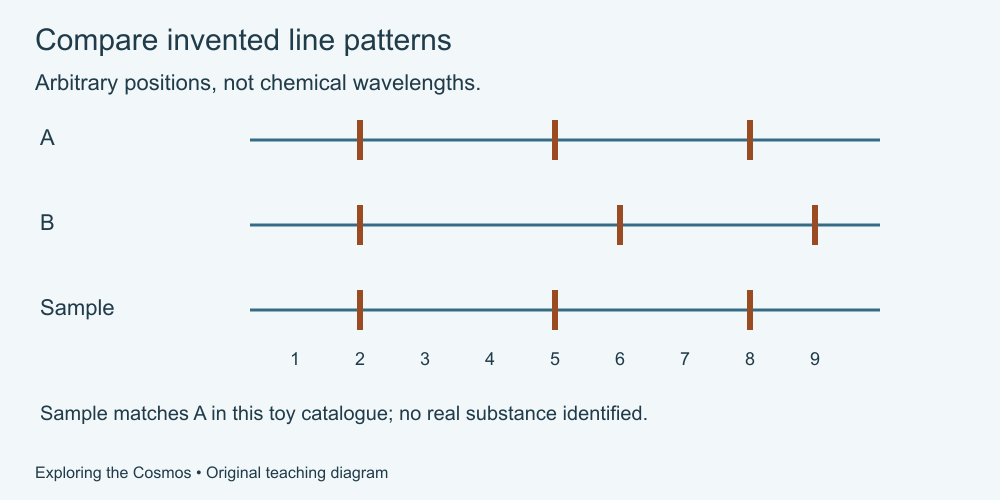

# 6. Learning from light

[Course home](../README.md) · [Glossary](../GLOSSARY.md)

**Goal:** Distinguish a recorded signal from an interpretation.

Adults 18+. All invented records and model numbers are labelled. Work on paper or an accessible equivalent; calculator optional.

## Understand

Visible light is only part of the electromagnetic spectrum. Instruments also study wavelengths our eyes do not detect. Images can assign visible colours to recorded signals; the caption and method matter.

A spectrum separates light by wavelength. Patterns of absorption or emission can help identify substances. This requires comparison with known patterns and attention to measurement conditions. One line is not a complete identification.

Brightness received by an instrument is not identical to an object's total light output: distance and intervening material can matter. Stellar colour can help estimate temperature, but an arbitrary image colour is not itself a temperature measurement.

Text equivalent: Invented line positions: reference A at 2, 5 and 8; reference B at 2, 6 and 9; sample at 2, 5 and 8. Positions are not physical wavelengths.

## Worked example

In an invented pattern exercise, reference A has lines at positions 2, 5 and 8; reference B has lines at 2, 6 and 9. A supplied sample has lines at 2, 5 and 8. It matches A within this toy catalogue. The positions are arbitrary and are not real chemical wavelengths.

## Practise

A new fictional sample has lines only at positions 2 and 5. Does it fully match A? What should you ask before identifying a real substance from such a result?

## Suggested reasoning

It partially matches A, but the expected line at 8 is not supplied. Ask whether the measurement covered that region, whether a weak signal could be missed and whether other reference patterns are possible. Do not call a partial toy match a confirmed discovery.

## Try a new situation

A picture colours an infrared signal purple. Can you conclude the object would look purple to your eyes? Check: no; first read how display colours were assigned.

[Source notes](../SOURCES.md) · [Next lesson](07-history.md) · [Reuse](../LICENSE.md)
