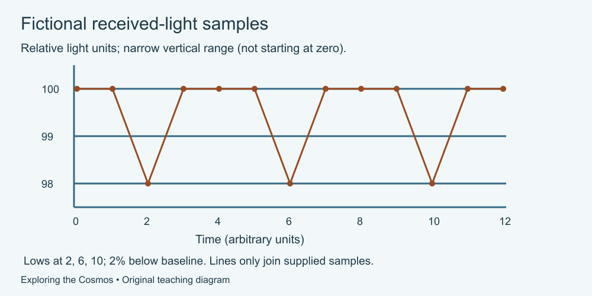

# 10. Build a space explanation

[Course home](../README.md) · [Glossary](../GLOSSARY.md)

**Goal:** Combine a model, numerical checks and a carefully limited conclusion.

Adults 18+. All invented records and model numbers are labelled. Work on paper or an accessible equivalent; calculator optional.

## Understand

This final task uses two separate fictional exhibits. Exhibit A is a distance drawing. Exhibit B is a relative-light time series. They do not describe the same system, and no connection between their objects is supplied.

A valid calculation is only one part of an explanation. State what the data describe, how the model represents them and what remains unknown.

Text equivalent: Fictional light samples from time 0 to 12 are 100 except at 2, 6 and 10, where they are 98. Dips are 2% below the supplied baseline; lines only join sampled points.

## Worked example

For a miniature example, a 50-unit baseline falls to 49: a 1-unit drop, or 2%. If fictional minima are at times 1, 4 and 7, adjacent intervals are 3 and 3. Repetition describes these supplied points, not proof of a particular cause.

## Practise

**Exhibit A — invented distances along a line**

| Object | Distance from reference star, fictional units |
|---|---|
| P | 1 |
| Q | 3 |
| R | 7 |

Draw at 2 cm per unit or describe the positions in text. Markers do not represent object diameters.

**Exhibit B — invented relative-light samples**

| Time, arbitrary units | Received light, relative units |
|---|---|
| 0 | 100 |
| 1 | 100 |
| 2 | 98 |
| 3 | 100 |
| 4 | 100 |
| 5 | 100 |
| 6 | 98 |
| 7 | 100 |
| 8 | 100 |
| 9 | 100 |
| 10 | 98 |
| 11 | 100 |
| 12 | 100 |

These are invented samples, not continuous measurements. The instrument, uncertainties, star properties and alternate explanations are unspecified. Connecting points only guides the eye.

1. Calculate the three drawing positions and Q-to-R gap in Exhibit A.
2. Calculate the absolute and percentage drop from the 100-unit baseline in Exhibit B.
3. Identify the times of minimum supplied light and the intervals between them.
4. Separate one observation from one possible explanation; explain why a planet is not confirmed.
5. Reject the claim “Object R caused the dips and is inhabited” using two missing connections or facts.
6. Write a short caption naming the fictional data, a result and a limitation.

## Suggested reasoning

1. P, Q and R are at 2, 6 and 14 cm; Q-to-R gap is 8 cm.
2. Drop: 100 − 98 = 2 units; 2 ÷ 100 × 100 = 2%.
3. Minimum samples occur at 2, 6 and 10; intervals are 4 and 4 time units.
4. The supplied samples contain repeating low values. A transit is one possible explanation, but the record supplies neither confirmation checks nor a unique cause.
5. The exhibits are separate; nothing identifies R as the cause. No evidence of life is given.
6. Example: “Fictional light samples fall 2% below baseline at three equally spaced times. The cause is not established, and the joined line is not a measured continuous curve.”

The sampling does not determine the full shape or duration of a dip. Do not equate the interval with a confirmed planet's orbital period without establishing the interpretation.

## Try a new situation

A new fictional Exhibit A places objects at 2, 4 and 8 units with the same scale. A new Exhibit B has baseline 200 and lows of 198 at times 3, 8 and 13. Check: drawing positions 4, 8 and 16 cm; drop 1%; intervals 5 and 5. The same limits on cause, confirmation and life remain.

[Source notes](../SOURCES.md) · [Review your work](../FACILITATOR-GUIDE.md) · [Reuse](../LICENSE.md)
