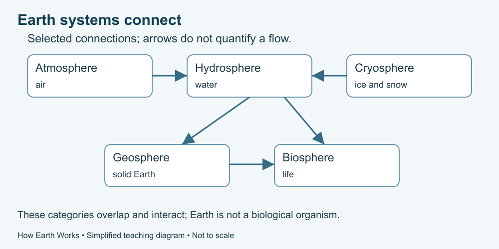

# 1. Earth as connected systems

[Course home](../README.md) · [Glossary](../GLOSSARY.md)

**Goal:** Trace a connection without treating a diagram as the whole world.

Adults 18+. All named places, scenarios and numbers in exercises are fictional. Work on paper or an accessible equivalent; a calculator is optional.

## Understand

Earth can be studied through interacting parts: the atmosphere (air), hydrosphere (water), geosphere (solid Earth), biosphere (life) and cryosphere (ice and snow). These labels help organize questions; they are not sealed compartments. NASA's Earth-systems learning resource connects matter and energy across systems.

The title “A Living System” refers to connected processes and ecosystems. It does not mean Earth is a biological organism or that every change restores a perfect balance.

Choose a boundary for your question. A diagram of a small catchment may omit deep groundwater or exchanges with neighbouring areas. An omitted arrow does not establish that an exchange is absent. Label what an arrow means: movement of water, transfer of energy or another relationship.

Text equivalent: Air, water, solid Earth, life and ice interact; the boxes are study categories, not sealed compartments.

## Worked example

In fictional Brook Vale, rain reaches soil, plants use some water and water can move toward a stream. That connects air, water, soil and life. A sketch containing only rain and a stream would leave out several possible stores and routes.

## Practise

Write three connections among these supplied items: rain, soil, plant and stream. For each, say what moves or interacts. Name one thing the sketch cannot tell you.

## Suggested reasoning

Possible connections: rain supplies water to soil; plants take up water from soil; water can move from the land toward a stream. The sketch does not establish amounts, timing or water quality. It cannot tell us whether a real stream is safe.

## Try a new situation

A diagram leaves out snow. Does that prove snow never matters? Check: omission may be a simplification. Ask about the place, season and purpose of the model.

[Source notes](../SOURCES.md) · [Next lesson](02-energy.md) · [Reuse](../LICENSE.md)
