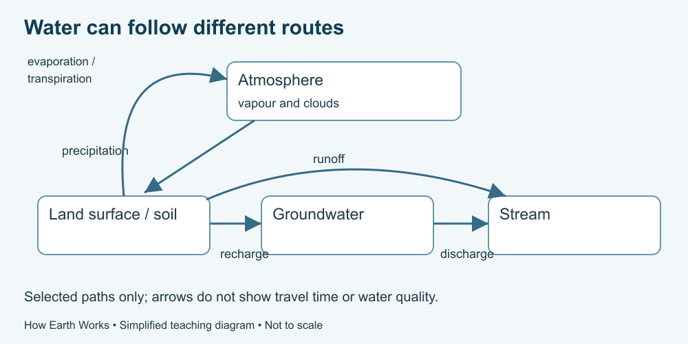

# 3. Water on the move

[Course home](../README.md) · [Glossary](../GLOSSARY.md)

**Goal:** Follow more than one route through a water model.

Adults 18+. All named places, scenarios and numbers in exercises are fictional. Work on paper or an accessible equivalent; a calculator is optional.

## Understand

USGS describes water stored above, on and below the surface, moving among those stores. Evaporation changes liquid to vapour; condensation forms liquid from vapour; precipitation brings water from clouds to the surface. Transpiration is water released as vapour by plants.

Water may run over land, enter the soil through infiltration or move through groundwater. Groundwater occupies pores and cracks and can discharge to surface waters. Sunlight and gravity help drive these movements.

There is no compulsory route that every drop follows on a fixed schedule. Some water remains stored for a long time. Our diagram includes selected paths, not all water exchanges or travel times.

Text equivalent: Selected routes include atmosphere to land by precipitation, land to stream by runoff, land to groundwater by recharge, and groundwater to stream by discharge. Evaporation and transpiration return water to the atmosphere.

## Worked example

Fictional route A: rain → land surface → stream. Route B: rain → soil → plant → atmosphere. Both illustrate possibilities. Their arrows alone do not tell us which route carries more water.

## Practise

Trace a third possible route using rain, soil, groundwater and stream. Then explain why “all rain reaches the stream immediately” is too strong.

## Suggested reasoning

Rain can enter soil, recharge groundwater and later discharge to a stream. Storage and alternative routes mean not all water reaches a stream immediately. The supplied model does not establish the delay.

## Try a new situation

A drawing shows clear-looking groundwater. Can you infer drinking-water safety? Check: visual style is not a water-quality test; this course supplies no drinking-water decision.

[Source notes](../SOURCES.md) · [Next lesson](04-surface.md) · [Reuse](../LICENSE.md)
