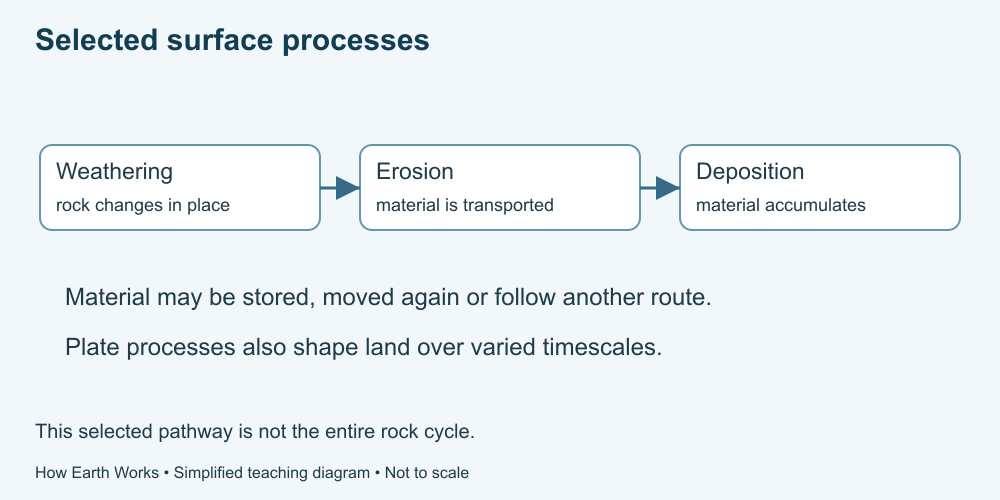

# 4. Rocks and a changing surface

[Course home](../README.md) · [Glossary](../GLOSSARY.md)

**Goal:** Distinguish processes and timescales that shape land.

Adults 18+. All named places, scenarios and numbers in exercises are fictional. Work on paper or an accessible equivalent; a calculator is optional.

## Understand

Tectonic plates are moving parts of Earth's outer rigid layer. The National Park Service explains how their interactions contribute to mountains, basins, earthquakes and volcanic activity. A plate diagram is a model, not a map of imminent events.

At the surface, weathering breaks down or chemically changes rock in place. Erosion involves removal and transport of material; deposition occurs where transported material accumulates. They are connected but not interchangeable words.

Change occurs over different timescales. Long-term landscape development can include short events. A photograph of a landform does not reveal its complete history or establish a safe route across it.

Text equivalent: Weathering changes rock in place; erosion transports material; deposition accumulates it. This is a selected pathway, not a complete rock cycle.

## Worked example

Fictional notes describe a rock breaking into pieces where it lies, grains being carried downstream, and grains settling. Label these weathering, transport by erosion, and deposition. The labels describe processes rather than proving a specific cause from a picture.

## Practise

Classify three supplied statements: A, minerals in rock change chemically; B, moving water carries sediment away; C, sediment accumulates in a quieter area. Explain one limit of this simplified chain.

## Suggested reasoning

A is chemical weathering, B describes erosion/transport, C deposition. Actual material can be stored, moved again or follow other routes; the chain is not a complete rock cycle or fixed timetable.

## Try a new situation

A person claims that knowing plates move lets them predict an earthquake tomorrow at a particular address. What additional conclusion has been smuggled in? Check: a general mechanism does not provide a precise local event prediction.

[Source notes](../SOURCES.md) · [Next lesson](05-soil.md) · [Reuse](../LICENSE.md)
