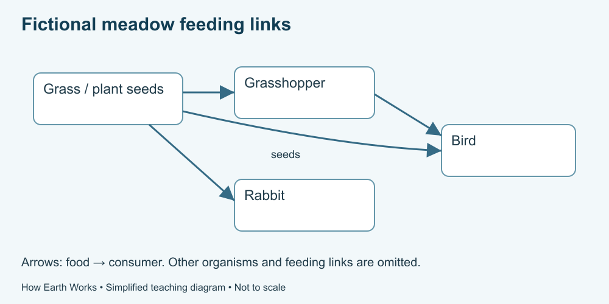

# 6. Ecosystems and relationships

[Course home](../README.md) · [Glossary](../GLOSSARY.md)

**Goal:** Read a food web without predicting every population change.

Adults 18+. All named places, scenarios and numbers in exercises are fictional. Work on paper or an accessible equivalent; a calculator is optional.

## Understand

An ecosystem includes organisms and their physical setting. A food web represents feeding connections. In our fictional web, arrows point from food toward the organism eating it, indicating transfer through feeding.

Producers such as green plants use energy to build organic material. Consumers obtain food from other organisms; decomposers process dead material and wastes. OpenStax explains how energy passes through ecosystems while materials participate in cycles. We focus on a sunlight-supported example; not all ecosystems use sunlight as their initial energy source.

A food web omits many details: amounts, seasonal changes, other foods, disease and habitat conditions. Removing one connection can affect others, but arrows alone do not calculate future population sizes.

Text equivalent: Fictional feeding arrows point from food to consumer: grass to grasshopper, grasshopper to bird, grass to rabbit and plant seeds to bird.

## Worked example

The fictional meadow web has grass → grasshopper → bird and grass → rabbit. The bird also eats seeds from the plants. This means it has more than the one displayed insect food source. The web is a teaching model, not a survey of a particular species.

## Practise

If fewer grasshoppers are available, name one possible effect and two reasons not to predict an exact bird count from the web.

## Suggested reasoning

Less insect food could affect birds, but other foods and habitat conditions may matter. The diagram gives no population, feeding-rate or seasonal data. A precise numerical forecast would exceed its evidence.

## Try a new situation

Someone draws an arrow from decomposers back to the Sun and calls it recycled energy. Correct it. Check: nutrients can cycle, while energy is transferred and dissipated as heat; the model does not return that heat to the Sun as food energy.

[Source notes](../SOURCES.md) · [Next lesson](07-climate.md) · [Reuse](../LICENSE.md)
