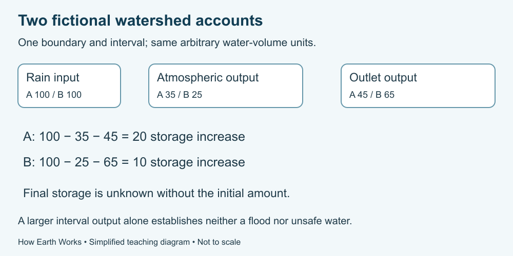

# 10. A watershed on paper

[Course home](../README.md) · [Glossary](../GLOSSARY.md)

**Goal:** Explain connected processes using a bounded fictional account.

Adults 18+. All named places, scenarios and numbers in exercises are fictional. Work on paper or an accessible equivalent; a calculator is optional.

## Understand

A watershed is a land area draining toward a common outlet; real groundwater relationships and boundaries can be more complicated than a simple surface sketch. Here we define one fictional account with no external groundwater exchange.

Treat the data below as invented model inputs and outputs, not evidence about actual land cover. Proposed explanations need additional evidence. Do not visit, sample or alter a waterway for this exercise.

Text equivalent: Fictional A budget: 100 rain units, 35 atmospheric output, 45 outlet output and 20 storage increase. B: 100, 25, 65 and 10 respectively.

## Worked example

A small fictional account begins with 10 water units stored. It receives 20 and releases 12 during the interval. Storage increases by 8 and ends at 18. Initial storage and change in storage are different values.

## Practise

Both fictional scenarios use the same defined boundary and interval. Atmospheric output combines evaporation and transpiration. Outlet output combines the water leaving through the stated outlet. Internal transfers are not additional outputs.

| Scenario | Rain input | Atmospheric output | Outlet output | Storage increase |
|---|---|---|---|---|
| A | 100 | 35 | 45 | 20 |
| B | 100 | 25 | 65 | 10 |

All values are the same arbitrary water-volume units. No measurements of slope, soil properties, rainfall intensity, water quality or outlet timing are supplied. Initial storage is unknown.

Claim 1: “B proves that removing plants always causes flooding and makes this water unsafe.”
Claim 2: “B has greater outlet output in this fictional interval, but the table does not establish its cause, peak flow or water quality.”

1. Check each budget and calculate B minus A for all three output/storage columns.
2. Choose the better claim and explain two unsupported parts of the other.
3. Trace a route connecting rain, soil, plants and the atmosphere, and another connecting rain to the outlet.
4. Name three missing facts needed before applying the model to a real location.
5. Explain whether final storage can be calculated.
6. Write a short report separating supplied results, a possible question and a limitation.

## Suggested reasoning

A balances: 35 + 45 + 20 = 100. B balances: 25 + 65 + 10 = 100. B minus A is −10 atmospheric output, +20 outlet output and −10 storage increase; together these differences sum to zero.

Claim 2 respects the limits. No land-cover change is recorded, greater interval output is not itself a peak-flow/flood prediction, and no water-quality data are supplied. A possible question is whether vegetation or other conditions differ; neither is established as the cause.

Routes include rain → soil → plant → atmosphere and rain → surface flow → outlet. Groundwater may provide another route in a fuller model. Missing facts include initial storage, soil/infiltration properties, rainfall timing and actual outlet measurements. Final storage cannot be calculated without initial storage, even though its change is supplied.

Example report: “Both fictional budgets balance. B has 20 more outlet units during the interval. We could ask which conditions account for the difference. The table alone establishes neither a cause nor a real flood or water-safety conclusion.”

## Try a new situation

New fictional scenario C has rain 120, atmospheric output 30, outlet output 60 and storage increase 30. Verify it, then explain why its outlet output cannot be attributed to one landscape difference from A. Check: it balances, but rain input also changed and other conditions are unspecified.

[Source notes](../SOURCES.md) · [Review your work](../FACILITATOR-GUIDE.md) · [Reuse](../LICENSE.md)
