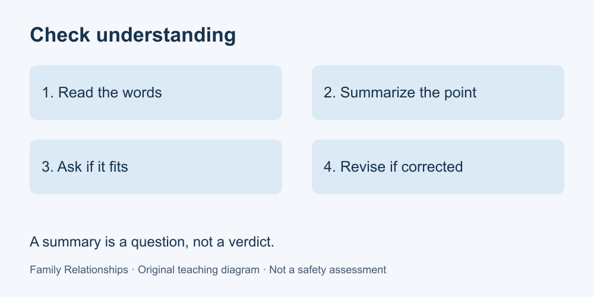

# 2. Listen and check understanding

[Course home](../README.md) · [Glossary](../GLOSSARY.md)

**Goal:** Write a short understanding check that allows correction.

Adults 18+. All people and situations below are fictional. Work on paper; skip or replace any scenario you do not want to read. No personal disclosure or real conversation is required.

## Understand

Listening is more than preparing your reply. In the NHS guidance linked in Sources, checking what you heard is one way to clarify meaning. Our practice uses a simple sequence: read the words, summarize the practical point, ask whether the summary is right, then adjust it.

A summary is a question, not a verdict. “You said evenings are difficult—is that right?” leaves room for correction. “You are avoiding us” supplies a motive. Understanding a request does not mean agreeing to it.

Use a form of communication the people can access. Do not score eye contact, speech speed or a particular facial expression as proof of attention. For this paper activity, the written words are the evidence.

Text equivalent: Read → summarize → ask → revise. Correction is part of understanding.

## Worked example

Lee says, “When plans change on the same day, I cannot rearrange my ride.” Pat replies, “So advance notice matters because of transport. Have I understood?” Lee adds, “Yes, two days would help.” Pat now has a more specific request; Pat has not promised that every future change can be prevented.

## Practise

Noor says, “I want to join dinner, but I cannot stay for the whole evening.” Compare: A: “You dislike spending time with us.” B: “Would joining for dinner and leaving afterwards work for you?” Explain which response checks meaning, and name something still unknown.

## Suggested reasoning

B offers a possible arrangement for confirmation. A invents a motive. We still do not know Noor's preferred departure time or whether the arrangement fits. A different short, neutral question also works. Repeating every word is unnecessary; do not add a commitment Noor did not make.

## Try a new situation

Taylor writes, “Phone calls are hard during my shift; messages are easier.” Draft a summary and a question about timing. Check that you do not assume messages can be answered immediately.

[Source notes](../SOURCES.md) · [Next lesson](03-requests.md) · [Reuse](../LICENSE.md)
