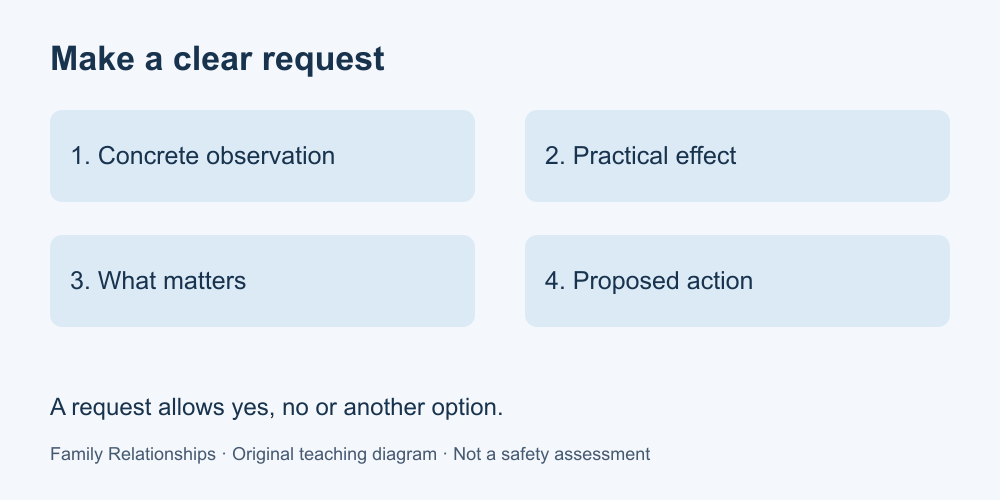

# 3. Express needs and make requests

[Course home](../README.md) · [Glossary](../GLOSSARY.md)

**Goal:** Turn a complaint into a specific, negotiable request.

Adults 18+. All people and situations below are fictional. Work on paper; skip or replace any scenario you do not want to read. No personal disclosure or real conversation is required.

## Understand

For ordinary, safe coordination, try four parts: a concrete observation, its practical effect, what matters to you, and a proposed action. This is a writing scaffold created for this course, not a tested formula or a guarantee of cooperation.

Compare “You are always inconsiderate” with “Yesterday the shared room was noisy during my call.” The second describes an event that can be discussed. Avoid using “I feel” to disguise an accusation, such as “I feel that you are selfish.”

A request can receive yes, no, a question or an alternative. Making it politely does not create consent. If a decision affects another person, leave space for their response. Do not use this exercise to rehearse confronting someone who frightens or threatens you.

Text equivalent: Observation → practical effect → need → proposed action. The other person may decline.

## Worked example

Dara writes: “Music was playing during my 2 pm call yesterday. I could not hear the caller. I need a quieter space for tomorrow's call. Would you use headphones from 2 to 2:30, or could we agree another room?” The request names a time and invites another option. It does not declare the other person's intent.

## Practise

Rewrite “You never help with meals” using these fictional facts: dinner preparation took Ren 45 minutes yesterday; Ren has a class tomorrow at 6; a meal is planned for 7. Ask for one concrete contribution without assuming the other person is free.

## Suggested reasoning

One answer: “I spent 45 minutes preparing yesterday's dinner. Tomorrow I have class at 6 and need to plan ahead. Could you prepare the vegetables before 6, or tell me what part is workable for you?” The proposed time can differ. Credit specificity and a real opportunity to decline; do not require an emotional disclosure or a perfect script.

## Try a new situation

A shared charger is often moved and you need it at 8. Draft a request about where to return it. Check that your wording describes an arrangement rather than attacking someone's character.

[Source notes](../SOURCES.md) · [Next lesson](04-boundaries.md) · [Reuse](../LICENSE.md)
