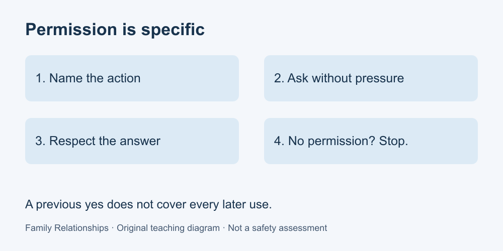

# 4. Boundaries, consent and privacy

[Course home](../README.md) · [Glossary](../GLOSSARY.md)

**Goal:** Choose a response that respects a stated limit.

Adults 18+. All people and situations below are fictional. Work on paper; skip or replace any scenario you do not want to read. No personal disclosure or real conversation is required.

## Understand

In these everyday exercises, consent means permission for a particular action. A family relationship is not automatic permission to share a photograph, read a message or borrow an item. Ask about the action you actually intend; do not stretch an earlier yes into a different activity.

A boundary can explain what someone is willing to do or share. It does not give them unrestricted control over another person's choices. “I can talk for ten minutes” describes availability; “You may never speak to your friends” attempts to control another person.

This lesson teaches everyday respect, not the legal rules of consent, guardianship or emergency disclosure. Those questions depend on context and qualified local guidance. Do not promise to keep every disclosure secret if a real safeguarding concern arises.

Text equivalent: Ask about the specific action. If permission is absent or refused, do not proceed.

## Worked example

Alex agrees to a photograph for a printed family album and says it must not go online. Casey wants to post it in a group chat. The album permission does not cover that new use. Casey asks once about the specific proposal; Alex says no. Casey leaves it unposted rather than lobbying relatives to persuade Alex.

## Practise

Morgan lends a book for one week but says not to lend it onward. Jules wants to pass it to a cousin. Identify the original permission, the proposed change and a respectful next action.

## Suggested reasoning

The permission covers Jules borrowing the book for a week. Onward lending is outside it and expressly excluded. Jules should not pass it on; they can tell the cousin the book is unavailable. Repeated pressure is not a respectful way to turn a refusal into permission.

## Try a new situation

Someone says, “I do not want my workplace mentioned in your announcement.” Draft a response and a revised announcement with that detail omitted. Check that the omission does not indirectly reveal the same information.

[Source notes](../SOURCES.md) · [Next lesson](05-responsibilities.md) · [Reuse](../LICENSE.md)
