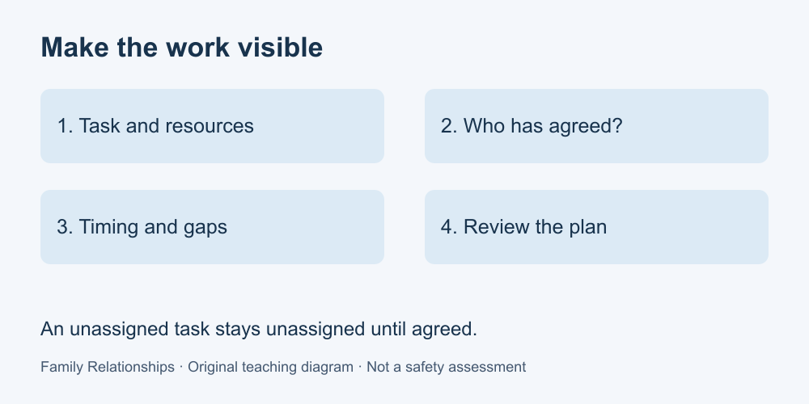

# 5. Share responsibilities

[Course home](../README.md) · [Glossary](../GLOSSARY.md)

**Goal:** Build a small agreement that accounts for capacity and review.

Adults 18+. All people and situations below are fictional. Work on paper; skip or replace any scenario you do not want to read. No personal disclosure or real conversation is required.

## Understand

A useful task agreement makes work visible: what needs doing, by when, what resources it needs, who has agreed and when the arrangement will be reviewed. Noticing supplies, planning, reminders and coordination are work too.

Equal task counts need not mean equal effort. Discuss the particular task and people's stated capacity instead of inferring ability from age or appearance. Someone may contribute planning without lifting; another may need a different method or more time.

An agreement is a proposal until the affected people accept it. A missed task is a reason to check what happened, not proof of laziness. This learning exercise is not a legal contract or a rule for allocating care duties.

Text equivalent: Task, person, timing, resources and review. A proposal needs agreement.

## Worked example

For a fictional shared lunch, Bea can carry bags, Kit can order supplies online and Lou can prepare a written menu. All agree: Lou drafts the menu by Tuesday; Kit confirms the order Wednesday using the agreed budget; Bea collects Friday after checking the pickup time. They review Thursday and agree whom to contact if something changes. A list saying only “Bea: food” would hide most of this work.

## Practise

A household needs laundry washed Saturday and a meal planned Sunday. Fin can operate the washer but cannot carry a basket; Kai can carry it Saturday morning; Val can plan the menu Sunday afternoon. Make a proposal with tasks, timing and one contingency question. Do not assign cooking to Val just because Val can plan.

## Suggested reasoning

A reasonable proposal: Kai moves the basket Saturday morning; Fin washes afterwards; Val drafts the menu Sunday afternoon. Ask who can move the clean laundry and who can prepare the meal—neither is given. Seek agreement before treating the allocation as settled. Naming missing work matters as much as filling the rows.

## Try a new situation

A supply order is delayed. Add a review step and an alternative to a fictional task plan. Check that no new person is assigned work without agreement.

[Source notes](../SOURCES.md) · [Next lesson](06-disagreements.md) · [Reuse](../LICENSE.md)
