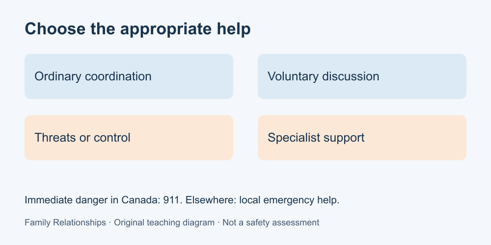

# 9. When conversation is not enough

[Course home](../README.md) · [Glossary](../GLOSSARY.md)

**Goal:** Match a fictional concern to an appropriate type of help.

Adults 18+. All people and situations below are fictional. Work on paper; skip or replace any scenario you do not want to read. No personal disclosure or real conversation is required.

## Understand

Some questions need resources beyond a conversation exercise. An ordinary practical dispute might benefit from agreed outside support. Threats, coercion or danger need a different response; the person experiencing harm is not responsible for fixing it through better wording.

For Canadian readers: in immediate danger or when urgent medical assistance is needed, call **911**. For non-emergency family-violence resources, use the federal directory linked below to find regional options. Outside Canada, use your local emergency number and relevant local services. Do not assume a listed service serves every age, gender, language or location; ask about eligibility, costs, privacy and availability.

Use a device and setting you believe are safe when seeking help. This static course, GitHub Issues and its publisher's email are not emergency or confidential support services. The lesson does not provide an individualized safety plan.

Text equivalent: Ordinary coordination, specialist support and emergency assistance are different routes.

## Worked example

Fictional example: Jo says a relative is restricting access to their money and frightening them. A learner should not answer, “Try a kinder request and keep the family together.” An appropriate educational answer recognises the concern, offers the verified family-violence help directory and leaves detailed next steps to suitable support. It does not instruct Jo to confront the relative or secretly collect evidence.

## Practise

Choose a type of help for each fictional case: A, disagreement over a mutually optional picnic menu; B, repeated threats by a household member with no immediate incident described; C, an immediate threat of serious harm in Canada. State one thing the story does not establish.

## Suggested reasoning

A: ordinary voluntary discussion may fit. B: specialist family-violence support; no immediate incident described does not prove safety. C: emergency assistance via 911. Unknowns can include the person's location, safe means of contact or service eligibility. Do not use this exercise to assess anyone in the room.

## Try a new situation

Find the “province or territory” structure in the directory if you choose to browse; otherwise write two questions you would ask a support service: “Do you serve this location?” and “What are the limits of confidentiality?” No real contact or disclosure is required.

References checked 11 September 2026: [PHAC family violence information](https://www.canada.ca/en/public-health/services/health-promotion/stop-family-violence/family-violence.html) and [Canadian help directory](https://www.canada.ca/en/public-health/services/health-promotion/stop-family-violence/services.html). Listings can change.

[Source notes](../SOURCES.md) · [Next lesson](10-project.md) · [Reuse](../LICENSE.md)
