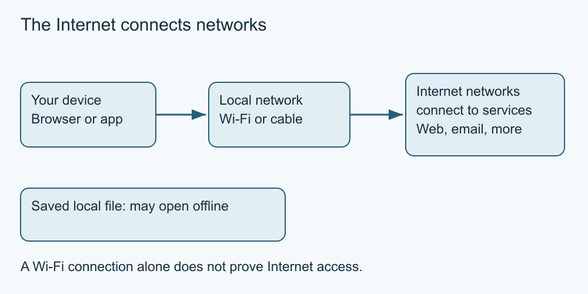

# 1. The Internet and the web

[Course home](../README.md) · [Curriculum](../CURRICULUM.md)

**Learning goal:** Distinguish a network, the Internet, a website and an application.

The Internet connects many networks so devices can exchange data. The web is one way to use those connections: a browser requests pages and other resources from web services. Email and other applications also use the Internet; they are not all web pages. An email service can offer both a browser website and a separate email application.

A browser is software on your device. A search engine is a service you can use through that browser. The search box may appear inside the browser's address bar, which makes these different jobs look similar. Opening a browser does not itself establish an Internet connection.

A local network connects nearby devices, for example through a home router. It can work while its Internet connection is unavailable. Wi-Fi describes a wireless connection to a network; a Wi-Fi symbol alone does not prove that a distant website is reachable. A saved document can sometimes open offline, while a new online search cannot. Whether an application works offline depends on its design and what is already stored.

*Simplified teaching diagram. The preceding explanation is its text alternative; not a product screenshot.*

## Worked example

Mina opens a saved event leaflet while her connection is unavailable. She can read it, but cannot fetch the organiser's latest notice. The leaflet's availability says nothing about whether its information is current.

## Try it — paper is enough

Classify each: (A) the browser program; (B) a search service; (C) a home Wi-Fi network; (D) a web page saved yesterday. Which could still be usable without Internet access?

## Answer and reasoning

A is local software; B is an online service; C is a local network; D is a stored copy. A, C and D may remain usable locally. B ordinarily needs a connection for a new query. “Usable” does not mean every feature works or the content is current.

## Use it somewhere else

Draw a device, its local network and a distant service. Explain one task that needs the distant service and one that does not.

## Sources and limits

[Internet Society: how the Internet works](https://www.internetsociety.org/our-work/how-the-internet-works/) provides the network-of-networks background.

[Next lesson](02-connections.md)

