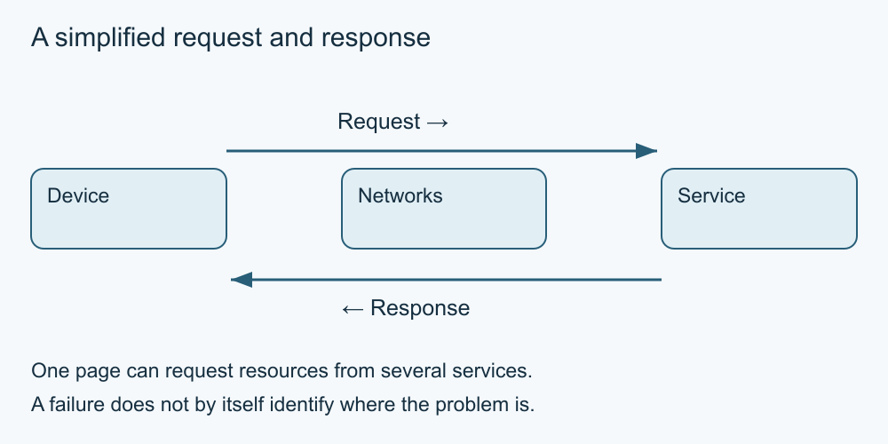

# 2. Connections and requests

[Course home](../README.md) · [Curriculum](../CURRICULUM.md)

**Learning goal:** Explain a request and choose a small, reversible check when access fails.

When you open an online page, your device sends requests and receives responses through connected networks. A server is a computer or service responding to requests. Pages often request several resources, sometimes from different providers. This course's diagrams simplify that activity; they are not measurements of a particular website.

Domain Name System (DNS) lookups help translate names into information used to reach services, commonly network addresses. Routing moves data through networks. A delay can arise on your device, its local connection, the provider's network or the remote service. One failed page does not identify the failing part.

Start with observations: What action failed? Is there an error message? Does a different already-known page load? Does another permitted device have the same problem? A page already visible may be a stored copy, so it is weak evidence of a working connection. Do not reset shared equipment or change security settings to complete this lesson.

Connection use can be metered. Large media and downloads may consume data allowances; this course requires neither. Ask the device or network owner before changing settings.

*Simplified teaching diagram. The preceding explanation is its text alternative; not a product screenshot.*

## Worked example

A fictional library page fails while a known weather page loads freshly. Mina records the library error and tries again later. She has evidence that some access works, not proof that the library itself is broken.

## Try it — paper is enough

Paper fault cards: A—all fresh online pages fail on one device; B—one page fails on two permitted devices; C—a saved PDF opens. For each, write what you know and what remains uncertain.

## Answer and reasoning

A suggests checking the device and connection, but does not locate the fault. B narrows the observation to that page or its access path, without proving a server fault. C only proves a local copy can open. A useful next check is small, authorised and reversible.

## Use it somewhere else

Write a two-sentence help request containing the attempted action, error and time. Invent the details; omit account identifiers and network passwords.

## Sources and limits

[Internet Society](https://www.internetsociety.org/our-work/how-the-internet-works/) supports the general network model. Troubleshooting here is a reasoning exercise, not a tested repair procedure.

[Previous lesson](01-internet-web.md) · [Next lesson](03-addresses.md)

