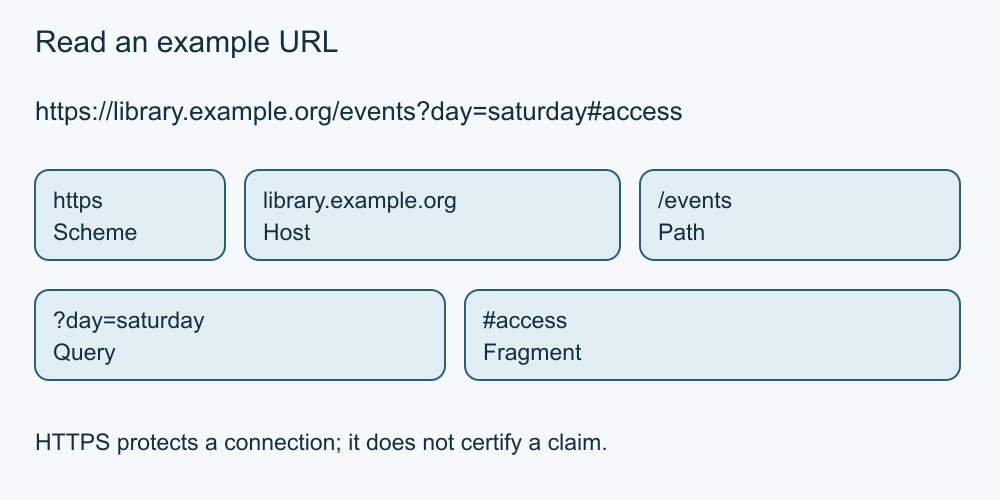

# 3. Browsers, addresses and links

[Course home](../README.md) · [Curriculum](../CURRICULUM.md)

**Learning goal:** Read an example address without mistaking a familiar word for its owner.

A URL is an address identifying a resource. In the fictional address `https://library.example.org/events?day=saturday#access`, `https` is the scheme, `library.example.org` is the host, `/events` is the path, the question mark introduces a query and the hash introduces a fragment within the resource. Real addresses vary; this example is deliberately simple.

A link's visible label can differ from its destination. On a device, inspect the destination using the browser's supported method before following an unexpected link. On paper, compare the printed label with the printed URL. Do not open suspicious examples for practice.

Compare `library.example.org` with `library.example.org.example.com`: the second belongs under example.com in this example, even though it contains the first name. Do not generalise “take the last two pieces” to every address; domain suffixes vary, such as co.uk. Unfamiliar structures are a reason to use an independently known route.

HTTPS encrypts communication with the addressed site, but a deceptive site can also use HTTPS. Browser security symbols do not certify the truth of the page or the honesty of its operator.

*Simplified teaching diagram. The preceding explanation is its text alternative; not a product screenshot.*

## Worked example

A card labelled “Library timetable” points to the second host above. Mina notices the mismatch and uses a previously verified organiser address instead. She does not need to investigate the suspect page.

## Try it — paper is enough

Mark the host and path in `https://events.example.com/help`. Does the word “help” identify the site owner? Does HTTPS guarantee the advice is correct?

## Answer and reasoning

The host is events.example.com and the path is /help. A path label does not establish ownership. HTTPS is a connection protection, not an accuracy or honesty guarantee.

## Use it somewhere else

Explain to a partner why a friendly link label is insufficient. Give one alternative route that avoids using that link.

## Sources and limits

Sources: [MDN: URLs](https://developer.mozilla.org/en-US/docs/Learn_web_development/Howto/Web_mechanics/What_is_a_URL), [FTC: HTTPS and shopping sites](https://consumer.ftc.gov/articles/online-shopping), [IANA: example domains](https://www.iana.org/help/example-domains).

[Previous lesson](02-connections.md) · [Next lesson](04-search.md)

