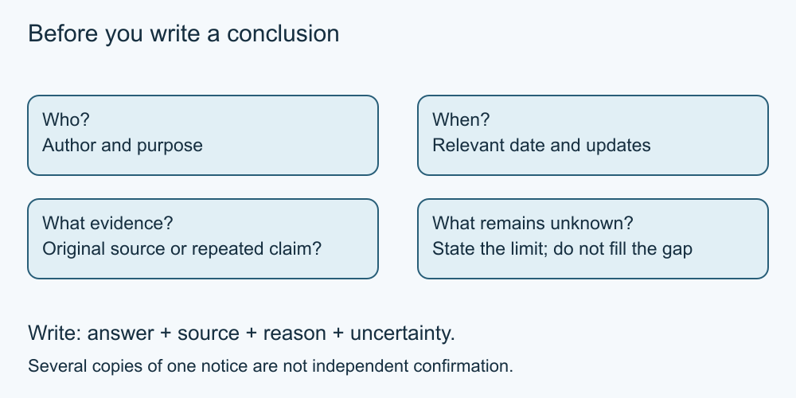

# 5. Trace and check sources

[Course home](../README.md) · [Curriculum](../CURRICULUM.md)

**Learning goal:** Separate a claim, its evidence and the uncertainty that remains.

Ask who made a claim, when, for what purpose, and what evidence supports it. A primary source reports its own activity or original work; a secondary source describes or interprets other material. Either can contain mistakes. For an event's current arrangements, the organiser's latest relevant notice is usually more direct evidence than an old repost. For an evaluation of that organiser, independent sources may answer a different question better.

Read beyond a headline. Check the event, location and date match your question. Follow a cited source when available. Two pages repeating the same notice are not two independent confirmations. A newer timestamp alone does not prove better information: a page can be republished without checking its contents.

Keep a short research note: question, source title or card, relevant date, claim, reason for relying on it, and remaining uncertainty. When sources conflict, explain the conflict rather than quietly selecting the answer you prefer.

This is a general reasoning method. It is not a substitute for professional advice in a high-stakes individual decision. Practising with a fictional event lets us learn the method without risking a real booking or purchase.

*Simplified teaching diagram. The preceding explanation is its text alternative; not a product screenshot.*

## Worked example

Card A: organiser notice dated 1 June, start 10:00. Card B: same organiser correction dated 3 June for the same event, start 11:00. Card C: undated repost of A. Mina records 11:00, cites B and notes that A was superseded. All cards are fictional.

## Try it — paper is enough

A fourth fictional card says “everyone loved last year's event.” Can it establish this year's start time, accessibility or quality? Write a supported conclusion and one unanswered question.

## Answer and reasoning

No. It reports an unspecific opinion about a different event. B supports the fictional current start time, but the cards do not establish accessibility or a guarantee of quality. A good answer states those limits.

## Use it somewhere else

Create a source note for B in your own words. Include which earlier claim changed, rather than copying a sentence without context.

## Sources and limits

The source-note method and fictional cards are original teaching material. See [Sources](../SOURCES.md) for the boundary between instructional exercises and external factual sources.

[Previous lesson](04-search.md) · [Next lesson](06-messages.md)

