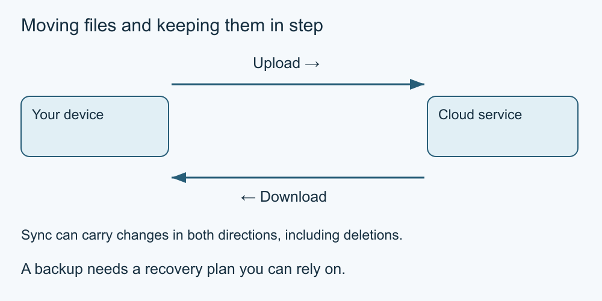

# 8. Downloads and cloud services

[Course home](../README.md) · [Curriculum](../CURRICULUM.md)

**Learning goal:** Distinguish downloading, synchronising and backing up.

Downloading transfers data from a remote service to your device. Uploading transfers data from your device to a remote service. Opening a page also transfers data; a separate Download button is not the only way information arrives. A downloaded file may remain after a browser window closes.

Cloud storage uses a provider's systems. Synchronisation tries to keep selected locations in step. That can include deletions, which is why a synchronised folder is not automatically an independent backup. Version history or a recycle bin may help in some services, but availability, permissions and retention limits differ. Check the actual service before relying on recovery.

Before downloading, ask whether you expected the file, trust its origin and need it. A familiar filename, icon or extension alone cannot prove safety. Do not disable security protections or run an unexpected program to read an event leaflet. An available web version or a trusted alternative may avoid the download.

Before uploading, examine what the file contains and who will be able to access it. Removing a shared link does not retrieve copies already downloaded. Deleting a local file does not establish deletion from every backup or recipient's device.

*Simplified teaching diagram. The preceding explanation is its text alternative; not a product screenshot.*

## Worked example

In a fictional synchronised folder, Mina deletes an obsolete leaflet. The cloud copy also disappears. This illustrates a possible sync effect, not a tested result on her device. She checks recovery documentation before depending on a restore.

## Try it — paper is enough

Classify: A—save a remote leaflet locally; B—send a local image into cloud storage; C—keep folder changes aligned; D—retain a separately recoverable copy. Which may propagate deletion?

## Answer and reasoning

A is download, B upload, C synchronisation and D backup. C may propagate deletion. A backup must actually support recovery for the problem being considered; calling a second copy “backup” is not proof of that.

## Use it somewhere else

On paper, plan a safe way to keep a fictional draft and share only its final version. Identify one recovery question you would check before using a real service.

## Sources and limits

[Microsoft: deleting OneDrive files](https://support.microsoft.com/en-us/onedrive/delete-files-or-folders-in-onedrive) documents service-specific deletion effects. Other services can behave differently.

[Previous lesson](07-accounts.md) · [Next lesson](09-privacy-scams.md)

