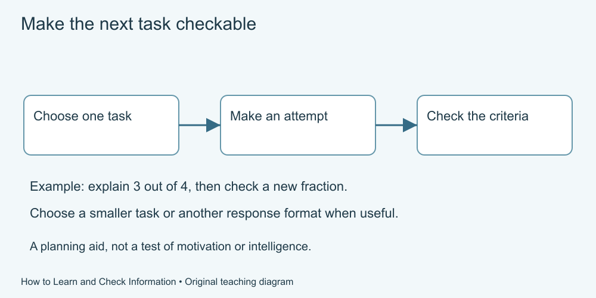

# How to Learn and Check Information

Practise a small skill, use feedback and explain what the evidence supports. Keep your own judgement when a claim, diagram or tool answer sounds convincing.

For **adult beginners, 18+**. This is an editorial audience choice, not tested age suitability. No prerequisite course, installation, AI account or purchase is required.

## Start learning

1. [Choose a useful goal](lessons/01-goal.md)
2. [Connect an explanation and an example](lessons/02-understand.md)
3. [Try recall, then check](lessons/03-recall.md)
4. [Return to practice and vary the example](lessons/04-return.md)
5. [Use feedback to revise](lessons/05-feedback.md)
6. [Read a claim carefully](lessons/06-claim.md)
7. [Trace and compare sources](lessons/07-sources.md)
8. [Read numbers and diagrams](lessons/08-numbers.md)
9. [Explain uncertainty and check tools](lessons/09-tools.md)
10. [Learn, check and explain](lessons/10-project.md)

Read in order or choose a topic through the [curriculum](CURRICULUM.md). Each lesson includes an explanation, a worked example, practice, suggested reasoning and a fresh situation.

Text equivalent: Define one task and its check, make an attempt, compare with the supplied criteria, and choose what to revise or try next.

## What you will practise

Apply a two-condition rule, recall invented labels, plan manageable revisits, improve an answer using specific feedback, trace a claim to its source and compare percentages. The final project supplies a fictional record, a copied report, a correction and a claim with missing evidence.

All required material is included. Use paper, speech, a table or another accessible equivalent; a calculator is optional. No timed assessment, required browsing, personal disclosure or public score sharing. Speed and grades are not measures of a person's worth.

## Supporting material

- [Curriculum](CURRICULUM.md)
- [Glossary](GLOSSARY.md)
- [Facilitator guide and rubric](FACILITATOR-GUIDE.md)
- [Developer reuse guide](DEVELOPER-GUIDE.md)
- [Research sources and limits](SOURCES.md)
- [Illustration provenance](ASSET-SOURCES.md)
- [Free reuse terms](LICENSE.md)

Research findings describe particular tasks and populations. This course offers practice, not guaranteed memory, grades or employment, a diagnosis, intelligence test or professional qualification. No learner pilot, independent education review or formal accessibility assessment has been performed.

For corrections, use [GitHub Issues](https://github.com/Green-Web-Land/Essential-for-Life/issues). Do not include private learning records or personal difficulties in public reports.

[Essential Knowledge for Life](../../README.md)
