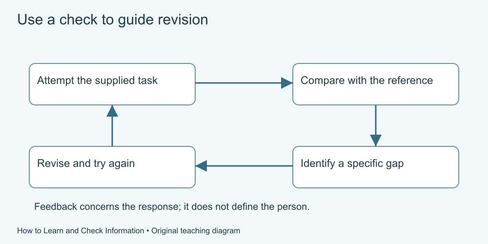

# 3. Try recall, then check

[Course home](../README.md) · [Glossary](../GLOSSARY.md)

**Goal:** Use a short attempt to find what needs correction.

Adults 18+. Supplied practice records are fictional. Use paper, speech or an accessible equivalent; calculator optional.

## Understand

Retrieval practice means trying to bring learned material to mind. It is not restricted to a formal test or a public score.

Karpicke and Roediger's 2008 experiment studied college students learning foreign-language word pairs and tested delayed recall after a week. Repeated retrieval helped in those conditions. It did not test every adult, subject or kind of understanding.

Here, make a brief attempt before comparing with the supplied reference. If you cannot recall something, consult the explanation and try again. The goal is a useful correction, not avoiding all mistakes.

Text equivalent: Attempt a small task, compare with the supplied reference, identify a gap, revise and try again. A check is feedback, not a judgement of worth.

## Worked example

Read this invented key: “Neri means circle; Tavo means square; Luma means triangle.” Cover it or look away if convenient. Try to recall what Tavo means, then check: square. These invented labels are not a real language.

## Practise

Using the same key, try recalling Neri and Luma. Compare with the key, note any mismatch and make another attempt. You may respond aloud or use the words “circle” and “triangle” without drawing.

## Suggested reasoning

Neri means circle; Luma means triangle. A mismatch tells you which pairing to revisit. If you looked at the key throughout, you completed supported practice; do not label that an unaided recall attempt.

## Try a new situation

A learner recalls all three immediately. Does that establish they will recall them next month or understand an unrelated topic? Check: no; those outcomes were not checked. Plan a later attempt if retention matters.

[Source notes](../SOURCES.md) · [Next lesson](04-return.md) · [Reuse](../LICENSE.md)
