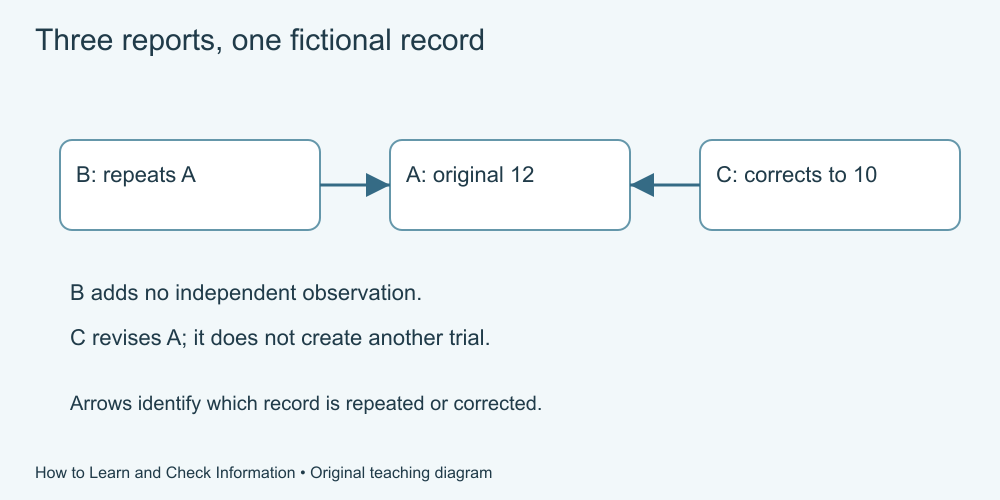

# 7. Trace and compare sources

[Course home](../README.md) · [Glossary](../GLOSSARY.md)

**Goal:** Distinguish repeated reporting from additional evidence.

Adults 18+. Supplied practice records are fictional. Use paper, speech or an accessible equivalent; calculator optional.

## Understand

A page can repeat another page without adding an independent observation. Trace where a specific claim came from, what evidence was available and whether a later correction changes it.

Civic Online Reasoning's public framework emphasizes the source, evidence and other coverage. In this course you practise with supplied fictional cards, not by browsing unfamiliar sites.

“Original” does not mean automatically correct. A correction, method note or relevant contrary source can change the interpretation. An unavailable source is a gap, not confirmation or proof of falsehood.

Text equivalent: Fictional A is the original record. B repeats A. C corrects A. B is not independent evidence, and C is not a separate trial.

## Worked example

Fictional packet:
- Card A: Cedar Desk's own note reports a count of 12.
- Card B: Town Summary repeats A's count and provides no new observations.
- Card C: Cedar Desk later corrects its count to 10 after removing two duplicate entries.

B is another report, not another independent measurement. C revises A's count; it is not a separate trial.

## Practise

Which count should describe the corrected record? Does B corroborate A independently? If a fourth card mentions an unavailable appendix, what can you honestly say about it?

## Suggested reasoning

Use 10 for the corrected count while retaining the history of the correction. B depends on A. State that the appendix was not available and avoid claiming its contents were verified. Its absence alone does not show it is false.

## Try a new situation

A new source collected a separate dataset with a different population and task. Is it independent and directly comparable? Check: it may be independent, but comparability still needs examination.

[Source notes](../SOURCES.md) · [Next lesson](08-numbers.md) · [Reuse](../LICENSE.md)
