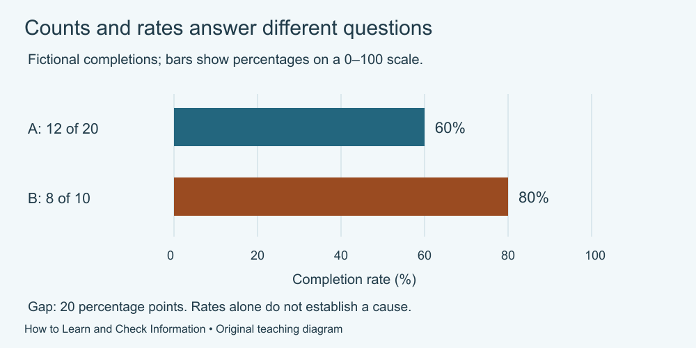

# 8. Read numbers and diagrams

[Course home](../README.md) · [Glossary](../GLOSSARY.md)

**Goal:** Compare rates using their denominators and retain causal limits.

Adults 18+. Supplied practice records are fictional. Use paper, speech or an accessible equivalent; calculator optional.

## Understand

A count answers “how many?” A proportion compares the count with its relevant total. Percentage equals count divided by total, multiplied by 100. Keep the numerator and denominator from the same group and outcome.

The difference between 60% and 80% is 20 percentage points. That is not the same wording as a 20% relative increase. Relative change needs a stated baseline.

Statistics Canada's explanation distinguishes association from causation. Different observed rates alone do not establish that a method caused the difference. Selection, prior knowledge and other conditions may matter.

Text equivalent: Fictional A: 12/20 = 60%; B: 8/10 = 80%. Bars show percentages from zero to 100, not counts. The gap is 20 percentage points.

## Worked example

Fictional groups: A has 12 completions among 20 people; B has 8 among 10. A's rate is 60%; B's is 80%. A has more completions but the lower completion rate. The difference is 20 percentage points.

## Practise

Group C has 9 completions among 15; group D has 6 among 10. Calculate both rates. If a chart makes C's bar taller just because 9 exceeds 6, what must its axis label say?

## Suggested reasoning

Both rates are 60%. A chart of counts may show 9 versus 6 if labelled as counts; a chart claiming to compare rates should show equal 60% bars. Group totals should be available. No causal conclusion follows.

## Try a new situation

In a separate fictional comparison, a rate changes from 40% to 50%. Check: increase 10 percentage points, or 25% relative to 40%. State which one you mean.

[Source notes](../SOURCES.md) · [Next lesson](09-tools.md) · [Reuse](../LICENSE.md)
