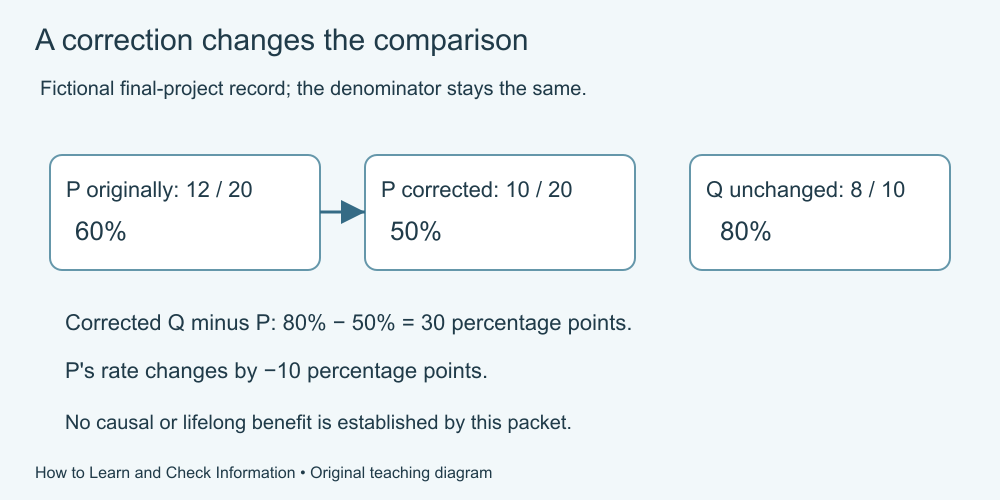

# 10. Learn, check and explain

[Course home](../README.md) · [Glossary](../GLOSSARY.md)

**Goal:** Revise a claim using a supplied source packet and a new example.

Adults 18+. Supplied practice records are fictional. Use paper, speech or an accessible equivalent; calculator optional.

## Understand

This project combines a small rule-learning task with a separate fictional reporting exercise. Your own answers are not observations in the group record. Do not combine them.

All cards, dates, people and counts below are invented. They are not an experiment demonstrating the effectiveness of this course or any learning strategy.

Text equivalent: Fictional P changes from 12/20 = 60% to 10/20 = 50%. Q remains 8/10 = 80%. The corrected Q-minus-P gap is 30 percentage points; no causal or lifelong benefit is established.

## Worked example

Mini-example: a corrected count of 3 completions among 5 people gives 60%. A second newsletter copying it does not create a second independent dataset. A cautious sentence is “The corrected fictional note reports 3 of 5; it does not establish why.”

## Practise

**Part 1 — apply a rule**

Tray K requires an even number AND a stripe. Classify card 6 with a stripe, card 7 with a stripe and card 8 without a stripe. Explain each decision.

**Part 2 — read the fictional packet**

| Card | Author and date | Supplied content |
|---|---|---|
| A | Cedar Desk, 12 May | Volunteers chose their own practice group. P: 12 of 20 completed one immediate sorting task. Q: 8 of 10 completed it. No prior-knowledge or later-retention results recorded. |
| B | Town Summary, 13 May | Repeats A. Headline: “P is the best method for everyone because 12 is greater than 8.” No new observations supplied. |
| C | Cedar Desk correction, 14 May | Two P completions were duplicate entries. Correct P to 10 of 20; the denominator remains 20. Q remains 8 of 10. |
| D | Community comment, 15 May | Claims an appendix proves lifelong benefits, but supplies no appendix or measurements. |

For calculation:

| Group | Original completed | Corrected completed | Total |
|---|---|---|---|
| P | 12 | 10 | 20 |
| Q | 8 | 8 | 10 |

1. Apply the tray rule to the three cards and state the conditions.
2. Calculate original and corrected rates for P and Q, and the corrected Q-minus-P gap in percentage points.
3. Identify which report repeats another, which changes the record and which has unavailable evidence.
4. Replace B's headline with a sentence consistent with the corrected record.
5. Explain why these data do not establish a causal or lifelong learning benefit.
6. Choose one small skill from your work to revisit, specify an attempt and a check, and identify a remaining uncertainty. You may use a fictional learner rather than yourself.

## Suggested reasoning

1. Only card 6 with a stripe belongs in K; 7 is odd and 8 lacks a stripe.
2. Original P: 12/20 = 60%; corrected P: 10/20 = 50%. Q stays 8/10 = 80%. Corrected gap: 80 − 50 = 30 percentage points. P's revision is −10 percentage points, not a 10% relative decrease.
3. B repeats A; C corrects A; D's appendix is unavailable. The correction is not an independent trial.
4. Example: “The corrected fictional record reports 50% immediate completion in P and 80% in Q; it does not establish the best method for everyone.”
5. Groups were self-selected, prior knowledge is not supplied and there is no delayed check. The task outcome does not measure lifelong learning.
6. Example plan: “Later, calculate a rate from a new supplied fraction, then check the numerator, denominator and result. I still cannot infer causation from the group rates.”

Keep uncertainty specific: the arithmetic is checkable even though causation is unresolved.

## Try a new situation

New fictional record: U has 6 of 12 completions; V has 9 of 15. Check: 50% and 60%, gap 10 percentage points. A larger rate still does not establish its cause. New tray rule requires an odd number AND a dot: card 5 with a dot belongs; card 6 with a dot does not.

[Source notes](../SOURCES.md) · [Review your work](../FACILITATOR-GUIDE.md) · [Reuse](../LICENSE.md)
