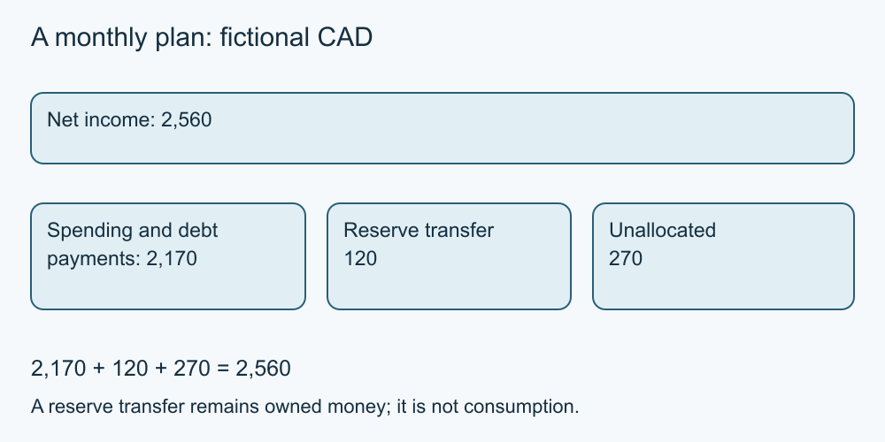

# 4. Build and revise a budget

[Course home](../README.md) · [Curriculum](../CURRICULUM.md)

**Learning goal:** Reconcile income with spending and planned transfers.

A budget is a plan for a specified period. Use consistent categories and distinguish spending from money moved into a reserve. In this example, all amounts are fictional monthly CAD. Net income is CAD 2,560.

| Planned use | CAD |
| --- | ---: |
| Rent | 1,100 |
| Utilities | 160 |
| Food | 400 |
| Transport | 120 |
| Phone | 60 |
| Insurance | 80 |
| Existing debt payment | 150 |
| Personal/other spending | 100 |
| Transfer to reserve | 120 |
| Total uses, including transfer | 2,290 |
| Unallocated remainder | 270 |

Spending and debt payments total CAD 2,170; the CAD 120 reserve transfer is still money held elsewhere. Total uses are CAD 2,290, leaving CAD 270 unallocated. “Unallocated” is not a recommendation to spend it, and it may be needed for something omitted.

The existing debt payment is a cash amount supplied for this month. The table does not calculate its principal/interest split. All transaction costs are assumed included in the supplied amounts. No additional receipt or spending is assumed.

Review a plan when information changes. A shortfall should be recorded honestly; renaming a necessary expense does not remove it. A balanced table also does not establish that every bill can be paid on time. Lesson 5 considers dates.

*Original teaching diagram; fictional CAD amounts where shown. The nearby text and tables provide the full explanation and assumptions.*

## Worked example

Food rises by CAD 70 and utilities by CAD 40 in the fictional revision. Total uses become CAD 2,400 and the remainder becomes CAD 160. Alex changes the plan instead of continuing to rely on the earlier CAD 270.

## Try it — paper is enough

Starting from the original table, reduce net income by CAD 300 with all uses unchanged. Calculate the result and name a question to investigate.

## Answer and reasoning

CAD 2,260 − CAD 2,290 = −CAD 30: a shortfall. Investigate whether the income change is temporary, whether anything is missing, and what verified support or feasible adjustments exist. Do not assume essentials can be cut.

## Use it somewhere else

Explain the difference between the CAD 120 transfer and the CAD 270 unallocated remainder.

## Sources and limits

[FCAC budget guidance](https://www.canada.ca/en/financial-consumer-agency/services/make-budget.html) [Source notes](../SOURCES.md) identify dates and jurisdiction. No real account or transaction was tested.

[Previous lesson](03-expenses.md) · [Next lesson](05-cash-flow.md)

