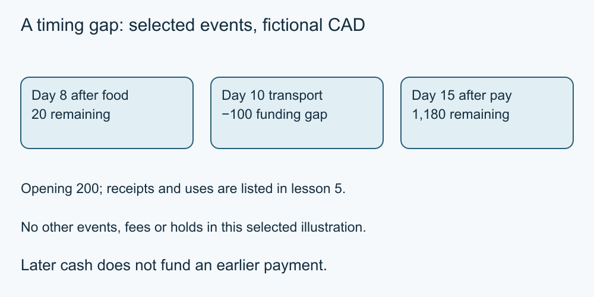

# 5. Cash flow and surprises

[Course home](../README.md) · [Curriculum](../CURRICULUM.md)

**Learning goal:** Find a timing gap even when a monthly total looks positive.

Cash flow tracks receipts and payments in order. Start with the opening amount, add a receipt when it becomes available and subtract a payment when it leaves. A monthly surplus can coexist with a temporary gap.

The following is a selected-event illustration, not the full budget in lesson 4. Fictional CAD; no fees, holds or other transactions. A negative balance is an unfunded gap in this model, not an authorised overdraft.

| Event | Change | Running amount |
| --- | ---: | ---: |
| Opening | — | 200 |
| Day 1 pay | +1,280 | 1,480 |
| Day 2 rent | −1,100 | 380 |
| Day 5 utilities | −160 | 220 |
| Day 8 food | −200 | 20 |
| Day 10 transport | −120 | −100 |
| Day 15 pay | +1,280 | 1,180 |

The day 10 gap needs attention before treating this schedule as workable. Possible questions include whether any timing can legitimately change, whether already-held funds are available or whether support is needed. A bill date cannot be changed simply by editing the paper calendar.

Unexpected costs and uncertain income make plans less predictable. A reserve can help only if it exists, can be accessed and is not already committed elsewhere. No fixed reserve percentage suits everyone.

If borrowing is considered, include its future payments and costs in a revised plan rather than treating the cash received as a permanent solution.

*Original teaching diagram; fictional CAD amounts where shown. The nearby text and tables provide the full explanation and assumptions.*

## Worked example

With a fictional opening amount of CAD 300 rather than CAD 200, the same selected events reach zero on day 10 and CAD 1,280 on day 15. This arithmetic shows the size of the timing gap; it does not establish that Alex has the extra CAD 100.

## Try it — paper is enough

Using the original CAD 200 opening schedule, identify the lowest amount and the extra opening cash that would just prevent a negative result.

## Answer and reasoning

The lowest amount is −CAD 100. An additional CAD 100, actually available before the gap, would make that point zero under these assumptions. Other bills could change the result.

## Use it somewhere else

Write one timing question and one uncertainty question for a fictional monthly plan.

## Sources and limits

Original fictional exercise and arithmetic; not a market offer or individual financial assessment. [Source notes](../SOURCES.md) identify dates and jurisdiction. No real account or transaction was tested.

[Previous lesson](04-budget.md) · [Next lesson](06-saving.md)

