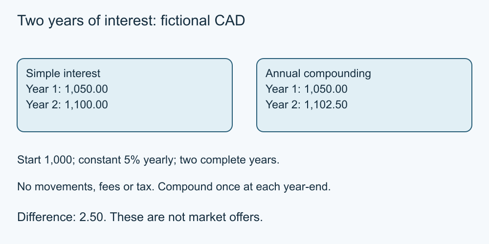

# 6. Saving, interest and purchasing power

[Course home](../README.md) · [Curriculum](../CURRICULUM.md)

**Learning goal:** Compare simple and compound calculations under explicit assumptions.

Interest can be calculated on an initial amount or on a balance that includes earlier interest. The rate, period, compounding and fees matter. Our examples are mathematical illustrations, not savings offers or return forecasts.

Assume CAD 1,000 deposited once at the start, a constant 5% annual rate, no deposits or withdrawals, no fees or tax, and two complete years.

| Model | End of year 1 | End of year 2 |
| --- | ---: | ---: |
| Simple interest on initial CAD 1,000 | 1,050.00 | 1,100.00 |
| Compounded once at each year-end | 1,050.00 | 1,102.50 |

Simple interest adds CAD 50 each year. Compound interest adds CAD 50 in year 1, then 5% of CAD 1,050 = CAD 52.50 in year 2. The difference after two years is CAD 2.50. These models do not establish how a real account calculates or credits interest.

For annual compounding with no other movements, the final balance is initial amount × (1 + annual rate) raised to the number of years. Write 5% as 0.05. For these exercises retain precision while calculating and round the final displayed result to cents.

Purchasing power concerns what money buys. In a separate invented example, a basket costing CAD 100 rises to CAD 104: a 4% increase. A balance growing by 2% does not keep pace with that basket. This is not a current inflation estimate; households purchase different things.

*Original teaching diagram; fictional CAD amounts where shown. The nearby text and tables provide the full explanation and assumptions.*

## Worked example

Alex compares the two year 2 totals only after checking that the initial amount, rate and period match. A higher-looking rate would not be enough to compare products with different fees or access conditions.

## Try it — paper is enough

For CAD 2,000 at 3% annually over three complete years, no other movements/fees/tax, calculate the simple-interest and annual-compound final balances.

## Answer and reasoning

Simple: CAD 2,180.00 = 2,000 + (2,000 × 0.03 × 3). Annual compound: CAD 2,185.45 after rounding 2,000 × 1.03³. Difference: CAD 5.45 at displayed precision.

## Use it somewhere else

Name three missing terms you would request before interpreting a real advertised savings rate.

## Sources and limits

[FCAC savings interest](https://www.canada.ca/en/financial-consumer-agency/services/banking/bank-accounts/savings-account.html) · [Bank of Canada inflation explanation](https://www.bankofcanada.ca/rates/related/inflation-calculator/) [Source notes](../SOURCES.md) identify dates and jurisdiction. No real account or transaction was tested.

[Previous lesson](05-cash-flow.md) · [Next lesson](07-fees.md)

