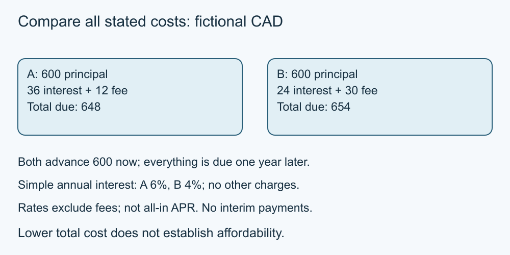

# 8. Borrowing and total repayment

[Course home](../README.md) · [Curriculum](../CURRICULUM.md)

**Learning goal:** Compare borrowing costs without confusing a rate with total cost.

Principal is the amount borrowed. Interest and fees add to the cost. Compare the amount actually received, timing, repayment schedule and all stated charges. A smaller advertised rate can still accompany a higher total repayment.

These are invented one-year balloon-payment examples, not real offers or standard instalment loans. Each advances CAD 600 in full at the start. There are no interim payments; principal, simple interest and the fee are all due exactly one year later. Rates remain fixed, no compounding applies, and there are no other charges or taxes. Assume on-time repayment; late-payment and early-repayment cases are outside this model.

| Offer | Simple annual rate | Interest | Fee due at maturity | Total due after one year |
| --- | ---: | ---: | ---: | ---: |
| A | 6% | 36 | 12 | 648 |
| B | 4% | 24 | 30 | 654 |

A's borrowing cost is CAD 48 and B's is CAD 54. A's total repayment is CAD 6 lower even though its stated interest rate is higher. These stated rates exclude fees and are **not** an all-in APR calculation.

For an instalment loan, interest may depend on the declining balance and payment timing. Do not apply this simple balloon formula to a different contract. A lower total cost also does not prove affordability or suitability. Consider whether a payment can actually be made when due and what remains unknown.

*Original teaching diagram; fictional CAD amounts where shown. The nearby text and tables provide the full explanation and assumptions.*

## Worked example

Alex records the amount received as CAD 600 for both, then compares CAD 648 and CAD 654 due on the same date. Alex does not conclude that either loan is needed or affordable.

## Try it — paper is enough

Under the same one-year balloon assumptions but principal CAD 1,000, compare C:5% interest plus CAD 20 fee, and D:4% plus CAD 40 fee.

## Answer and reasoning

C totals CAD 1,070 with CAD 70 borrowing cost. D totals CAD 1,080 with CAD 80 cost. C is CAD 10 lower. This comparison establishes cost only under the supplied assumptions.

## Use it somewhere else

Name two contract details that would require recalculation and one personal-context question this course cannot answer.

## Sources and limits

[FCAC loan cost guidance](https://www.canada.ca/en/financial-consumer-agency/services/loans/personal-loans.html) [Source notes](../SOURCES.md) identify dates and jurisdiction. No real account or transaction was tested.

[Previous lesson](07-fees.md) · [Next lesson](09-help.md)

