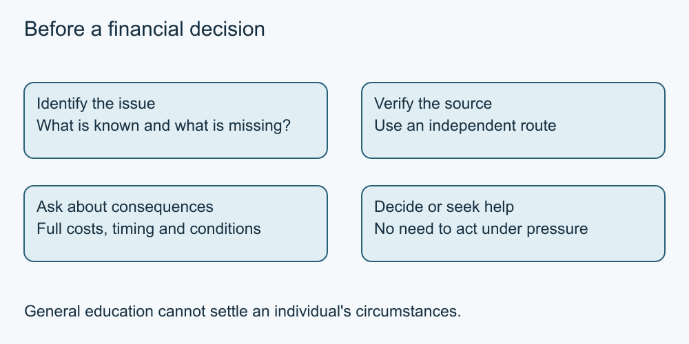

# 9. Debt difficulties, scams and reliable help

[Course home](../README.md) · [Curriculum](../CURRICULUM.md)

**Learning goal:** Identify a verified help route without guessing a personal remedy.

A difficult money situation deserves clear information, not blame. If a fictional plan cannot cover obligations, acknowledge the gap and identify what facts are needed. Different remedies can have different costs and consequences. This course does not select a debt strategy, determine legal rights in a dispute or assess insolvency.

When considering help, check the organisation's identity, qualifications, services, fees and written terms. “Non-profit,” “expert” or a reassuring advertisement is not enough information by itself. Canada's FCAC guidance explains questions to ask when seeking credit counselling; it does not mean every provider is suitable for everyone.

Unexpected promises of guaranteed approval, instant debt erasure or a reward for immediate payment should prompt independent verification. Do not use contact details from a suspicious message as the only way to verify it. Do not share passwords, sign-in codes or financial records merely to find out whether an offer is genuine.

Use an official source relevant to the location and issue. A lender complaint, credit counselling and an insolvency question are different matters. An established bank contact, an official regulator's information or a verified qualified professional may be appropriate depending on the need. Do not assume one agency handles every problem.

Required exercises use invented messages only. No learner must disclose debt or contact a service.

*Original teaching diagram; fictional CAD amounts where shown. The nearby text and tables provide the full explanation and assumptions.*

## Worked example

A fictional message promises Alex's debt will disappear after an immediate “processing” payment. Alex pauses, avoids the message's payment link and uses an independently found official information route. Alex has identified a risk, not proven who sent the message.

## Try it — paper is enough

Draft three questions for a hypothetical help provider and one way to check its identity independently.

## Answer and reasoning

Ask what service is proposed, its full fees and consequences, and the person's relevant qualifications. Check through an official or otherwise independently established directory/contact route rather than the advert alone. A real choice may need more information.

## Use it somewhere else

Explain why “choose the smallest monthly payment” is insufficient advice without knowing total costs, duration and consequences.

## Sources and limits

[FCAC credit-counselling guidance](https://www.canada.ca/en/financial-consumer-agency/services/debt/debt-help.html) · [Canadian Anti-Fraud Centre](https://antifraudcentre-centreantifraude.ca/protect-protegez-eng.htm) [Source notes](../SOURCES.md) identify dates and jurisdiction. No real account or transaction was tested.

[Previous lesson](08-borrowing.md) · [Next lesson](10-project.md)

