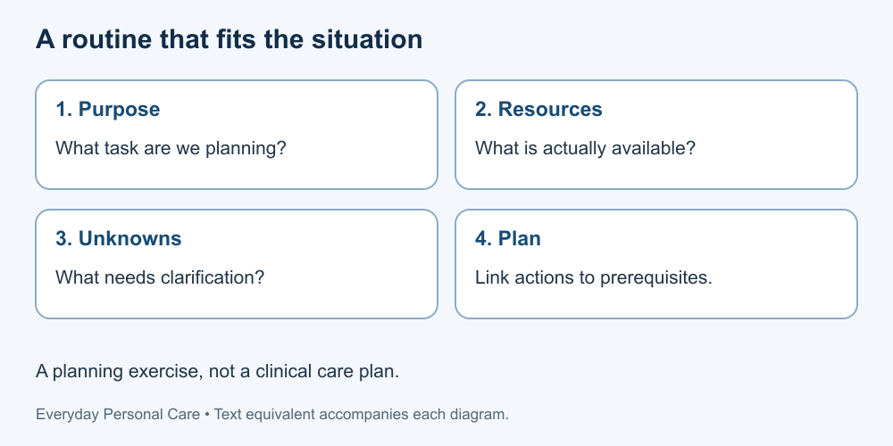

# Everyday Personal Care

Everyday hygiene, grooming, clothing care, rest and manageable routines. Learn to plan with dignity, respect individual needs and recognise when general information is not enough.

**Audience: adult beginners, 18+.** This is an editorial audience choice, not a clinical suitability assessment. Younger learners should use material prepared for their age with appropriate adult guidance. No prior course, AI account or product purchase is needed.

## How to use this course

Read in order or use the curriculum to find a topic. Each lesson includes an explanation, a worked fictional example, an activity, suggested reasoning and a new situation. Work on paper using only the supplied fiction. No bathing, grooming or other physical demonstration, health record, photograph or personal disclosure is required. Skip sensitive examples without explaining why.

General education cannot replace individual medical or dental advice. Keep existing professional care instructions; ask the relevant professional if following or adapting them is difficult. This course does not diagnose symptoms, prescribe treatment, train caregivers or certify competence. Resources, culture, hair and skin needs, mobility and personal preferences differ. There is no single ideal appearance or universal routine.

## Lessons

1. [Care, dignity and realistic routines](lessons/01-routines.md)
2. [Supplies, labels and access](lessons/02-supplies.md)
3. [Hand hygiene](lessons/03-hands.md)
4. [Body hygiene and bathing](lessons/04-bathing.md)
5. [Everyday oral care](lessons/05-mouth.md)
6. [Hair, grooming and nails](lessons/06-grooming.md)
7. [Clothing, towels and bedding](lessons/07-clothing.md)
8. [Rest, comfort and consistency](lessons/08-rest.md)
9. [Recognise limits and ask for help](lessons/09-help.md)
10. [Build a fictional care plan](lessons/10-project.md)

Text equivalent: Begin with a purpose, identify available resources, name missing information, and propose a manageable plan. This is an educational planning method, not a clinical care plan.

## Supporting material

- [Curriculum](CURRICULUM.md) — goals and route through the course.
- [Glossary](GLOSSARY.md) — terms used in the lessons.
- [Facilitator guide](FACILITATOR-GUIDE.md) — paper activities, feedback and rubric.
- [Developer guide](DEVELOPER-GUIDE.md) — reuse and integration.
- [Sources](SOURCES.md) — dated references and their limits.
- [Illustration provenance](ASSET-SOURCES.md) — five original diagrams.
- [Free reuse terms](LICENSE.md) — sharing, adaptation and commercial reuse under CC BY 4.0.

The final exercise assesses reasoning about a fictional plan, not anyone's health, hygiene or worth. Lessons and diagrams have not been clinically validated or tested with learners. Text equivalents support access; no formal accessibility conformance is claimed.

## Questions and corrections

Use [GitHub Issues](https://github.com/Green-Web-Land/Essential-for-Life/issues) for general material corrections. Do not post personal health information or photographs. The publisher and course discussion are not a medical or confidential care service. For individual care questions, seek a relevant qualified professional; for an actual emergency, seek local emergency assistance.

[Essential Knowledge for Life](../../README.md)
