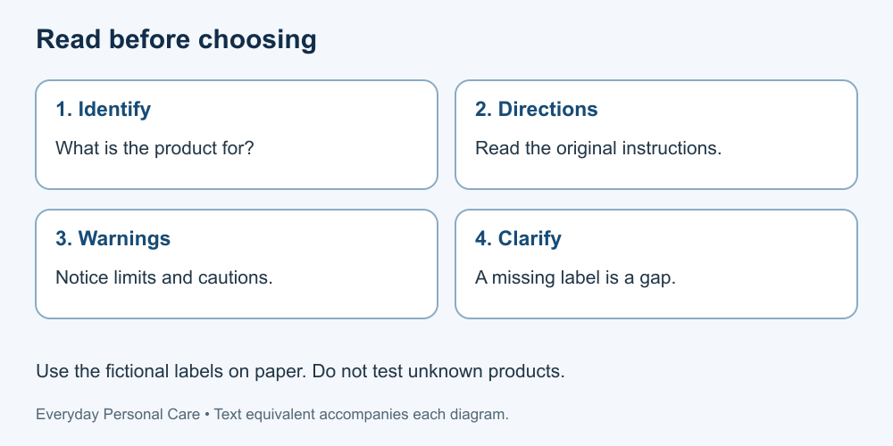

# 2. Supplies, labels and access

[Course home](../README.md) · [Glossary](../GLOSSARY.md)

**Goal:** Identify missing information before using a product or planning assistance.

Adults 18+. All people, labels and scenarios used in exercises are fictional. Work on paper; no physical demonstration or personal disclosure is required. You may skip a scenario.

## Understand

A product's intended use matters more than an appealing package. Read its label, directions and warnings. Household surface cleaners are not body-care products. Health Canada advises following household-chemical labels, retaining original containers and not mixing household chemical products.

For this course, use only the fictional labels printed in the exercise. No product purchase, opening, smelling or testing is required. A blank or damaged label is missing information, not an invitation to guess from colour or scent.

Access includes reachable storage, water, privacy and an understandable format. If assistance is needed, agree what help is wanted; do not assume permission for personal contact or sharing health details.

Text equivalent: Identify the product, read directions and warnings, and clarify gaps before use.

## Worked example

Two fictional containers are labelled “hand soap” and “bathroom surface cleaner—not for skin.” Sam chooses the first for the handwashing plan and keeps the second out of personal-care supplies. This label-reading example does not establish that any unlabelled bottle is suitable.

## Practise

A donated bottle has no readable label. A friend says it is probably shampoo. Write a next step and explain why “try a small amount” is not an adequate answer.

## Suggested reasoning

Set it aside rather than use it on the body. Obtain reliable identification and directions from the original packaging or supplier; if that cannot be done, ask about appropriate disposal. A guess or informal assurance does not supply the missing safety information.

## Try a new situation

A fictional person can read large print but not small text. Propose an accessible way to obtain the original instructions without replacing them with guessed directions.

[Source notes](../SOURCES.md) · [Next lesson](03-hands.md) · [Reuse](../LICENSE.md)
