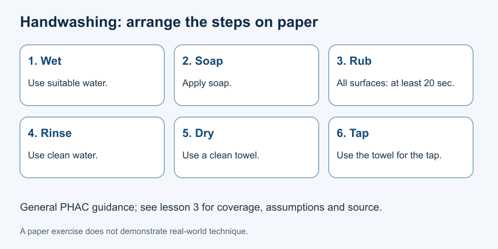

# 3. Hand hygiene

[Course home](../README.md) · [Glossary](../GLOSSARY.md)

**Goal:** Arrange the general handwashing sequence and explain its scope.

Adults 18+. All people, labels and scenarios used in exercises are fictional. Work on paper; no physical demonstration or personal disclosure is required. You may skip a scenario.

## Understand

The Public Health Agency of Canada recommends soap and water when possible, particularly for visibly dirty hands. Its general sequence is: wet hands, add soap, rub all hand surfaces for at least 20 seconds, rinse with clean water, then dry with a clean towel; use the towel to turn off the tap. Include palms, backs, thumbs, between fingers and beneath nails.

Hand cleaning matters before handling food and after using the toilet. It reduces risk; it does not make every later action safe or replace other precautions.

The exercise assumes access to suitable water and soap. If water access is limited or an advisory applies, follow the current local public-health advice; different advisories are not interchangeable. The linked PHAC page covers alternatives. This lesson is not a healthcare or food-service certification.

Text equivalent: Wet → soap → rub all surfaces for at least 20 seconds → rinse → dry. Use the towel for the tap.

## Worked example

Fictional Jo's paper sequence says “wet, soap, rub, rinse, dry.” The sequence is in order, but the rubbing step needs its duration and coverage. Jo adds “at least 20 seconds, all surfaces,” plus the clean towel and tap detail. No physical demonstration is needed.

## Practise

Arrange these cards: dry with a clean towel; apply soap; wet; rinse; rub all surfaces for at least 20 seconds. Identify one assumption about supplies.

## Suggested reasoning

Wet → apply soap → rub → rinse → dry. The plan assumes suitable water, soap and a clean drying option are available. Do not treat a correct sequence on paper as proof of correct real-world technique.

## Try a new situation

A notice says there is a water advisory, but does not specify its type. Write a clarification question rather than deciding tap water is safe. [PHAC guidance](https://www.canada.ca/en/public-health/services/healthy-living/hand-hygiene.html), checked 11 September 2026.

[Source notes](../SOURCES.md) · [Next lesson](04-bathing.md) · [Reuse](../LICENSE.md)
