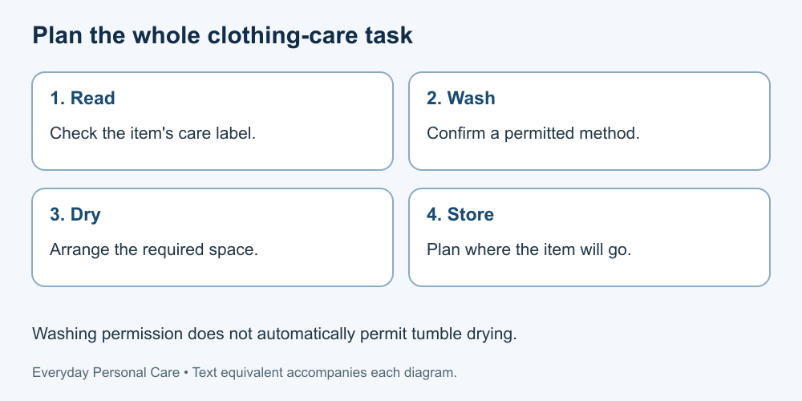

# 7. Clothing, towels and bedding

[Course home](../README.md) · [Glossary](../GLOSSARY.md)

**Goal:** Build a cleaning plan that respects labels and actual facilities.

Adults 18+. All people, labels and scenarios used in exercises are fictional. Work on paper; no physical demonstration or personal disclosure is required. You may skip a scenario.

## Understand

Read the item's care label and the product and machine instructions before choosing a method. Washing and drying directions can differ. Do not assume that a label permitting washing also permits a heated dryer.

For these exercises, the labels are invented plain-language examples. They are not standard symbols or instructions for your own belongings. Canada's consumer guide explains care-label categories but states that its cited national standard was withdrawn; we do not present that guide as a current mandatory standard.

Plan collection, washing, drying and storage as separate tasks. Include access to the required facility and somewhere appropriate for drying. Clothing, towels and bedding can have different needs; this lesson does not prescribe one cleaning frequency or an infection-control process for all circumstances.

Text equivalent: Read the label, plan washing, arrange drying, then store the prepared item.

## Worked example

Fictional shirt A says “gentle wash; dry flat.” A plan that washes gently and then tumble-dries it follows only half the label. The corrected proposal needs a suitable flat drying space, not merely a different wash setting.

## Practise

Towel B's fictional label allows machine washing and tumble drying. Sweater C says “hand wash; dry flat.” Only a machine washer and dryer are currently available. Explain which item's listed facilities are available and which plan has a gap.

## Suggested reasoning

The available machines match B's listed methods, subject to their actual instructions. C still needs a permitted hand-washing setup and flat drying space; do not put it through B's process for convenience. Ask about suitable facilities or another label-consistent option.

## Try a new situation

A blanket's label is unreadable. Write a way to seek its care instructions instead of guessing a hot cycle. Do not mix cleaning chemicals. [Care-label reference](https://ised-isde.canada.ca/site/office-consumer-affairs/en/product-safety-recalls-and-labelling/guide-apparel-and-textile-care-symbols).

[Source notes](../SOURCES.md) · [Next lesson](08-rest.md) · [Reuse](../LICENSE.md)
