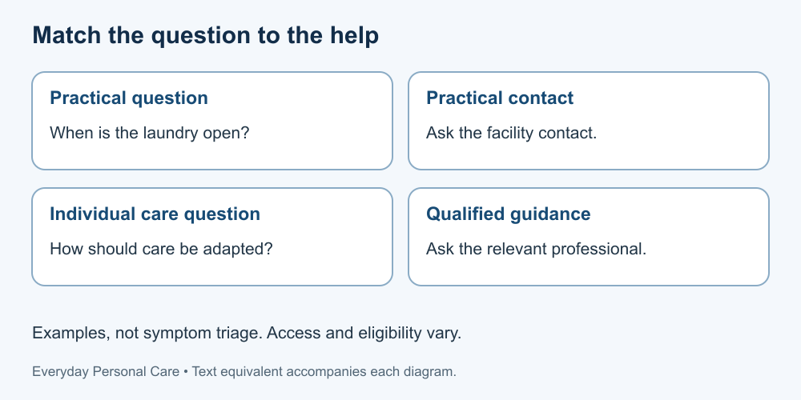

# 9. Recognise limits and ask for help

[Course home](../README.md) · [Glossary](../GLOSSARY.md)

**Goal:** Write a focused question and choose a suitable kind of support.

Adults 18+. All people, labels and scenarios used in exercises are fictional. Work on paper; no physical demonstration or personal disclosure is required. You may skip a scenario.

## Understand

A general lesson can explain a principle but cannot examine a person or determine a diagnosis. Questions about pain, changing symptoms, special equipment or whether a product suits a condition belong with a relevant qualified professional.

Distinguish practical help from clinical judgement. A facility manager may explain laundry access; a dental professional can discuss oral-care adaptations. A trusted helper may assist with an agreed task but should not be treated as automatically qualified to decide treatment.

For an actual emergency, seek local emergency assistance rather than waiting for a course response. This is not a symptom checklist or triage tool. GitHub Issues and publisher email are not medical or confidential care services. Availability, cost and eligibility of professional support must be checked locally.

Text equivalent: Practical access questions and individual health questions need different kinds of help.

## Worked example

Fictional Jo cannot read a toothpaste label and also has a dental-care question. Accessible label information addresses the first problem; it does not answer the second. Jo can ask the supplier for readable directions and a dental professional about suitability.

## Practise

Sort these questions: A, when the shared laundry room opens; B, how to adapt a brush for a person's grip; C, whether to change an existing clinical skin-care plan. Name a suitable type of contact and one unknown.

## Suggested reasoning

A: facility contact; actual hours unknown. B: dental professional or appropriately qualified support; the person's needs require assessment. C: the relevant treating professional; reasons and suitable changes are unknown. No answer promises an appointment, treatment or funding.

## Try a new situation

Write a brief fictional question using: task, difficulty, existing instruction and requested clarification. Do not include a real name, diagnosis, photograph or health record. Check that the question asks for guidance rather than demanding a particular treatment.

[Source notes](../SOURCES.md) · [Next lesson](10-project.md) · [Reuse](../LICENSE.md)
