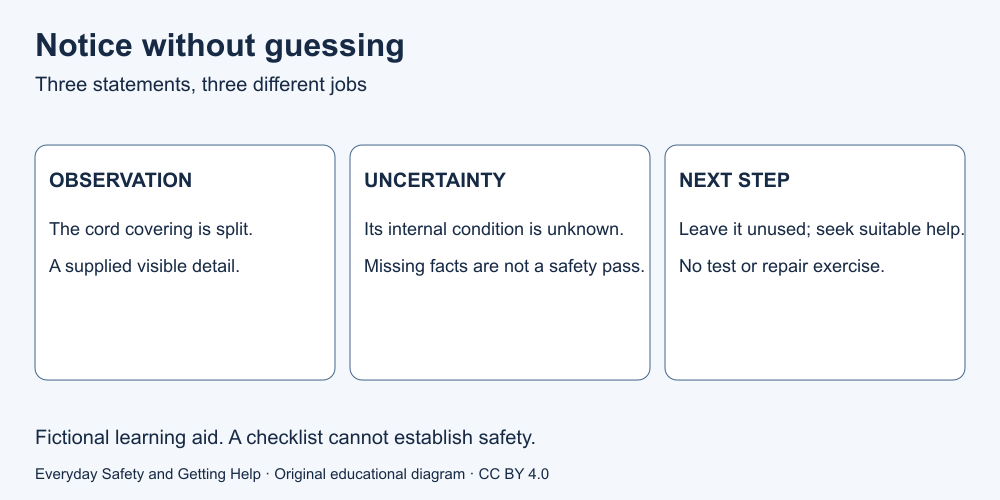

# 1. Notice a possible hazard

[Course home](../README.md) · [Curriculum](../CURRICULUM.md)

## Goal

Separate what you observe from what you assume.

## Understand

A hazard is something that could cause harm. An observation is a specific detail; an assumption fills in something you do not know. You can make a cautious decision without proving exactly what will happen. Equally, one worrying detail does not tell you every fact about a situation.

An unplugged extension cord with visible damage should not be used. The Electrical Safety Authority explains that damaged cords can cause shock or fire. Looking at a picture cannot establish whether equipment is fit for service. This course teaches recognition, not inspection or repair. [Source S8](../SOURCES.md)

Text equivalent: “The cord covering is split” is an observation. “I do not know its internal condition” states uncertainty. “Do not use it; ask the responsible person for suitable replacement or qualified help” is a decision.

## Worked example

Fictional case N1: A table card says: “Extension cord unplugged. Covering visibly split. No smoke, heat or injury reported.” Jo writes, “It has never hurt anyone, so it is safe.” That last statement is not established by the card. Jo can avoid using the damaged cord without opening it or testing it.

## Paper activity

On paper, label each statement observation, uncertainty or unsupported conclusion: (a) the card reports a split covering; (b) the inner parts may be damaged, but we do not know; (c) plugging it in briefly will prove it is safe. Write a replacement for (c) that does not involve a test.

## Suggested reasoning

(a) Observation about the supplied card. (b) Uncertainty. (c) Unsupported and an unsafe proposed test. A better answer is to leave it unused and contact the responsible person for replacement or qualified advice. “No injury reported” is not a certificate of safety.

## Try the distinction again

Use the fictional sentence “A notice is partly unreadable.” Write one fact you have and one fact you still need. Do not inspect actual equipment for this exercise.

[Next lesson: Pause without delaying urgent help](02-next-step.md)

