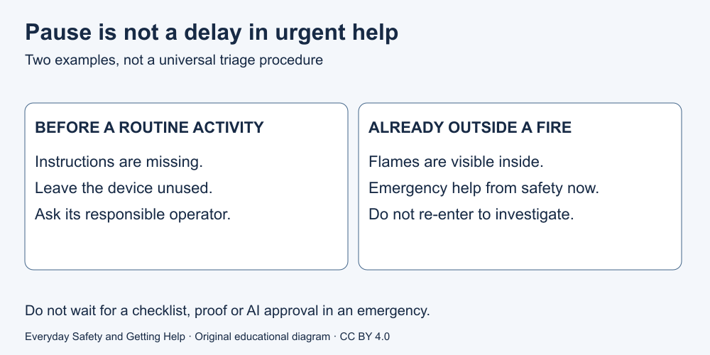

# 2. Pause without delaying urgent help

[Course home](../README.md) · [Curriculum](../CURRICULUM.md)

## Goal

Distinguish stopping a routine activity from delaying emergency help.

## Understand

“Pause” means stop an activity that may add danger. It does not mean wait for certainty, finish a checklist, ask AI or collect photographs before seeking urgent help. A course cannot rule out an emergency from incomplete information.

In a real police, fire or medical emergency in Toronto, call 911. If immediate danger is present, a routine enquiry service is not the right substitute. The scenarios below deliberately supply different facts; they are learning examples, not a diagnostic test. [Source S1](../SOURCES.md)

Text equivalent: unfamiliar instructions before starting → leave the activity stopped and ask appropriate help. Already outside a building with fire → emergency help now, no re-entry. Neither branch certifies any other situation.

## Worked example

Fictional case P1: Lee has not started using an unfamiliar device and cannot find its instructions. There is no reported incident. Lee leaves it unused while asking its responsible operator. Changed fact P2: Lee is already outside and sees flames in the building. Lee calls emergency help from safety rather than waiting for the operator.

## Paper activity

Choose which response belongs to P1 and P2: “Ask for the correct operating instructions before use” or “Seek emergency response now.” Explain why finishing this lesson must not become a step in P2.

## Suggested reasoning

P1 fits instructions before use; P2 fits emergency response. The new fact changes urgency. The lesson is not a permission system for calling for help. Someone does not have to complete paperwork or prove the cause of a fire first.

## Try the distinction again

Rewrite “Always research before acting” to include the difference between ordinary uncertainty and urgent danger. Keep the answer fictional.

[Next lesson: Everyday spaces and equipment](03-spaces.md)

