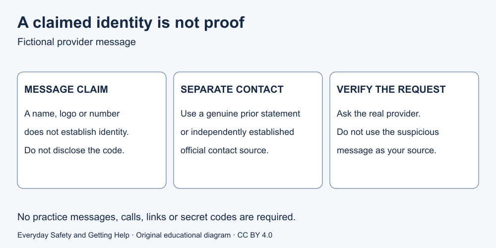

# 7. Suspicious messages and requests

[Course home](../README.md) · [Curriculum](../CURRICULUM.md)

## Goal

Verify a claimed identity through a separate established route.

## Understand

A displayed name or telephone number can be imitated. Pressure to act urgently is not proof of authority. When a suspicious message claims to come from an organisation, obtain its contact information separately instead of using the message's link or number. [Source S12](../SOURCES.md)

Do not give an unsolicited requester passwords, access codes or private records. You do not need to argue with them or prove fraud before withholding information. If you already acted, contact the affected organisation through its genuine channel promptly; this course cannot undo the action.

Text equivalent: claimed identity is unverified. Use an existing trusted statement or genuine official contact source, not the message's supplied route. Ask the organisation whether the request is real.

## Worked example

Fictional case M1: a message labelled “Your provider” says, “Send your access code now; use our supplied contact number.” Alex has an earlier genuine account statement. Alex uses the established contact route on that statement, without sending the code or using the message's number. No actual message, number or link is supplied in this exercise.

## Paper activity

Compare three choices: reply with the code; call the number in the message; use the genuine prior statement to contact the provider. Explain why the first two do not independently establish the sender's identity.

## Suggested reasoning

The third choice is the independent route in this fictional packet. Replying discloses a secret; the supplied number may lead back to the same sender. A genuine-looking logo is not authentication. Even a successful verification call does not establish that all future requests are genuine.

## Try the distinction again

Changed fact M2: the statement itself came as an attachment to the suspicious message. Is it still independent evidence? No. Explain how a separately established official source differs. Do not search for or contact suspected scammers.

[Next lesson: Choose the right help route](08-help.md)

