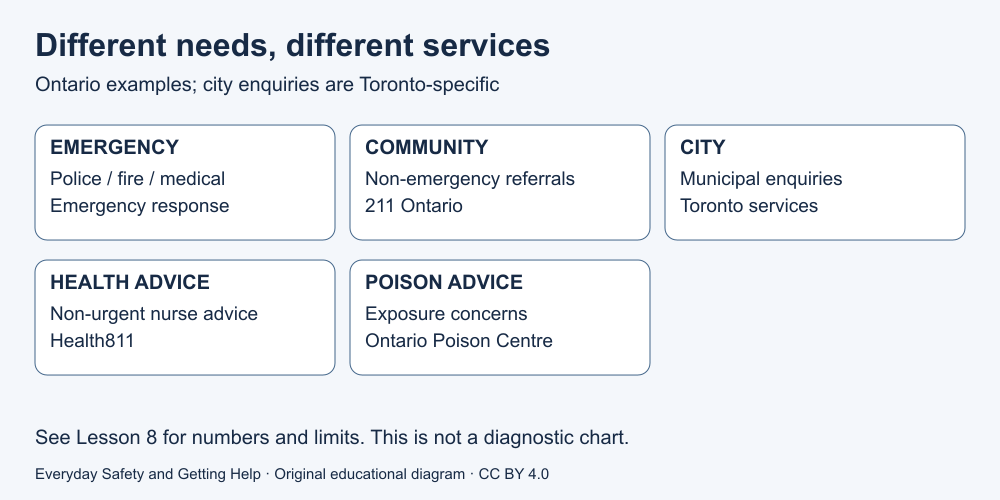

# 8. Choose the right help route

[Course home](../README.md) · [Curriculum](../CURRICULUM.md)

## Goal

Match a fictional need to the service's purpose and location.

## Understand

These are telephone examples for **Ontario, with municipal services limited to Toronto**. They are not a worldwide directory. In an emergency use the local emergency service; do not wait to finish a course or obtain AI approval.

| Need | Telephone example | Scope |
|---|---|---|
| Police, fire or medical emergency | **911** | Toronto/Ontario emergency response |
| Community or social-service information | **211** | Ontario non-emergency referral |
| City service enquiry | **311** | Toronto municipal services |
| Non-urgent nurse advice or health-service navigation | **811 — Health811** | Ontario |
| Poison exposure concern or question | **1-800-268-9017 — Ontario Poison Centre** | Ontario poison advice |

[Official sources and access notes S1–S5](../SOURCES.md). Poison questions may be urgent: this is not a reason to wait for a routine appointment. Unconsciousness or breathing difficulty requires emergency response.

Text equivalent: match the need and jurisdiction, not simply the shortest number. A referral does not guarantee eligibility, a bed, an appointment or an immediate response. Current telephone and accessibility arrangements must be checked with each provider during preparation, not by making practice calls.

## Worked example

Fictional route cards: H1, already outside a building with visible fire in Toronto; H2, finding a local community meal programme in Ontario, with no immediate danger; H3, Toronto waste-collection enquiry; H4, non-urgent nurse advice in Ontario; H5, possible harmful household chemical exposure, person awake with no severe symptom stated.

## Paper activity

Write the matching route for H1–H5. Then answer H6: H5 changes to unconsciousness. Finally H7: the learner is outside Canada. Does the course establish that any of these numbers will connect there? Do not dial or send messages.

## Suggested reasoning

H1: 911. H2: 211. H3: 311. H4: 811 — Health811. H5: 1-800-268-9017 — Ontario Poison Centre, promptly. H6: 911 immediately. H7: no; use that location's official emergency and other services. The examples do not provide a complete triage system or prove that a real situation is non-urgent.

## Try the distinction again

Make a fictional preparation card with three blank headings: local service purpose, official source, access arrangements. Do not fill it with personal information. This activity does not require testing a connection.

[Next lesson: Explain what happened](09-explain.md)

