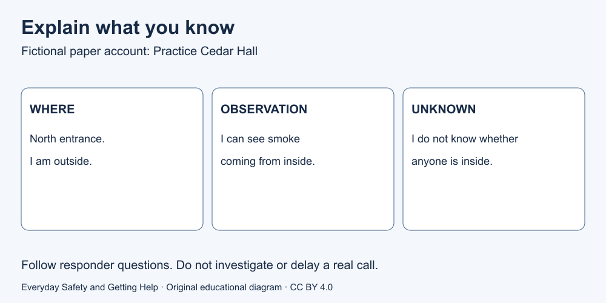

# 9. Explain what happened

[Course home](../README.md) · [Curriculum](../CURRICULUM.md)

## Goal

Give concrete information without inventing a cause.

## Understand

When contacting emergency help, location matters. Respond to the dispatcher's questions and instructions; say what you know and what you do not know. Do not delay a call to compose a perfect report. Do not hang up until told to do so. [Source S1](../SOURCES.md)

For a routine report, useful information is also concrete: where the concern is, what you observed and what help you are asking for. Share necessary details through the appropriate service, not a public class post. The exercise uses only invented facts.

Text equivalent: where → what observed → what unknown. This is an organising aid for paper practice, not a script that overrides a responder.

## Worked example

Fictional case R1: “Practice Cedar Hall, north entrance. I am outside. I can see smoke coming from inside. I do not know whether anyone is inside.” That is more useful than “The wiring definitely caused a fire,” which the card does not establish. Practice Cedar Hall is not a real location for contacting services.

## Paper activity

Write a short paper account for R1. Keep the location and observation; mark the unknown. Cross out the unsupported wiring claim. Then write how you would react if a responder asked a question before you finished your prepared account.

## Suggested reasoning

A good account uses the supplied location, smoke observation and uncertainty about occupants. Follow the responder rather than insisting on completing a script. Do not enter to investigate missing facts. In a real call provide the real location, not the fictional name.

## Try the distinction again

Alternative routine case R2: “Practice library printer displays an error; nothing else is reported.” Write a report to library staff. This can replace R1 if emergency examples are uncomfortable.

[Next lesson: Make a safer decision](10-decisions.md)

