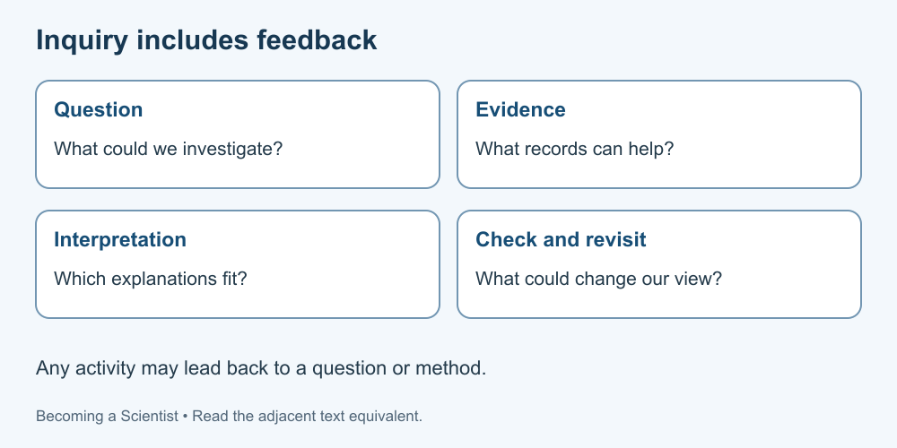

# 1. Science as inquiry

[Course home](../README.md) · [Glossary](../GLOSSARY.md)

**Goal:** Explain how questions and evidence can change an explanation.

Adults 18+. All named people, examples, role cards and datasets are fictional. Use paper or an accessible equivalent; a calculator is optional.

## Understand

Science builds explanations that can be examined against evidence. Work can involve observations, experiments, mathematical models and comparisons of existing records. Asking a useful question and checking an answer are connected activities, not a guaranteed recipe for discovery.

The University of California Museum of Paleontology describes science as iterative: findings can send a researcher back to a question or method. Our diagram is a simplified planning aid. Real projects may enter at different points and revisit them.

A scientific explanation must do more than sound appealing. Ask what would be expected if it were useful, what observations could challenge it and what alternatives remain. Revising an idea in response to evidence is productive; changing the record to protect the idea is not.

Different fields need different methods. An astronomer cannot move a star into a laboratory. Comparing observations can still test an explanation, provided its assumptions and limits are examined.

Text equivalent: Questions, evidence, interpretation and checking can feed back into one another.

## Worked example

Fictional Robin notices that a printed pattern looks darker under one lamp. Robin proposes that the lamp matters. Before declaring a discovery, Robin asks whether the paper, viewing angle or recording device also changed. The initial observation prompts a better comparison.

## Practise

A fictional report says: “We asked a question, did one test and got an answer, so our explanation can never change.” Identify two problems and write a better ending.

## Suggested reasoning

One test does not establish every possible circumstance, and evidence can require revision. A better ending is: “This result supports our explanation under the stated conditions; we should examine alternatives and check whether it holds elsewhere.” This wording still needs the actual evidence.

## Try a new situation

A fictional archive contains weather observations but no experiment. Can it be useful to science? Explain a possible comparison and one limitation. Check: historical observations can inform questions, but missing methods or changing conditions may limit interpretation.

[Sources and limits](../SOURCES.md) · [Next lesson](02-questions.md) · [Reuse](../LICENSE.md)
