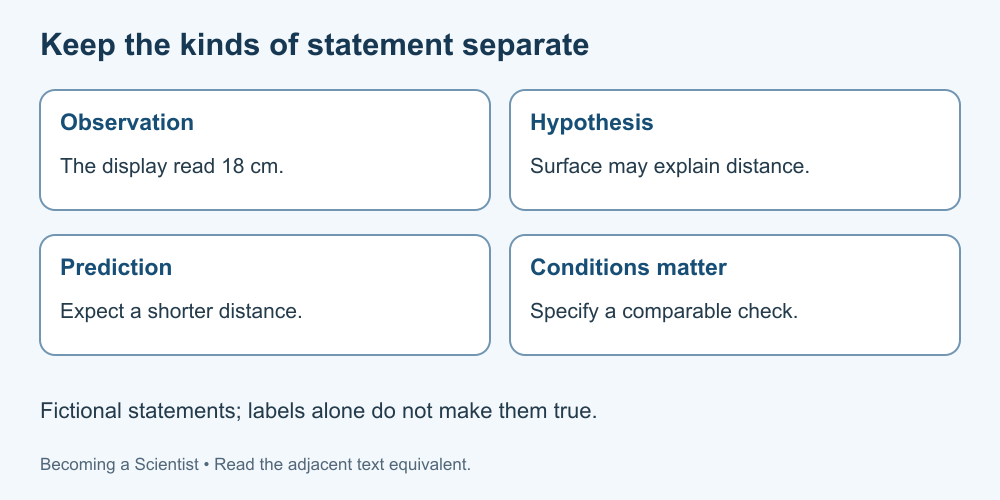

# 3. Observation, hypothesis and prediction

[Course home](../README.md) · [Glossary](../GLOSSARY.md)

**Goal:** Keep a recorded observation separate from its explanation.

Adults 18+. All named people, examples, role cards and datasets are fictional. Use paper or an accessible equivalent; a calculator is optional.

## Understand

An observation is a recorded feature or event. A hypothesis proposes an explanation; a prediction describes what that explanation leads you to expect under stated conditions. An interpretation connects evidence to a claim. The OpenStax reference introduces these distinctions.

Observations depend on how they were obtained. “The display read 12 cm” reports a reading; it is not proof the actual distance was exactly 12 cm. Records can contain mistakes or limitations.

Several explanations can fit one observation. A prediction is useful when evidence could meaningfully count against it, not when every possible result is treated as confirmation.

Text equivalent: A recorded reading is an observation; a proposed cause is an explanation; an expected future result is a prediction.

## Worked example

Fictional record: “The strip's displayed length was 12 cm.” Hypothesis: “The strip expanded because its temperature changed.” Prediction: “Under specified comparable conditions, the proposed explanation predicts a change in length when temperature changes.” The record alone supplies neither the cause nor the size of a future change.

## Practise

Label these fictional sentences: A, “The display read 18 cm”; B, “A different surface may explain the distance”; C, “If that explanation holds here, the second surface will give a shorter distance in a comparable check.” What evidence is missing?

## Suggested reasoning

A is an observation of a display; B is a proposed explanation; C is a conditional prediction. Comparable records, measurement details and other changing factors are missing. None of the labels makes the claim true.

## Try a new situation

Write an observation and two possible explanations for a fictional missing line in a notebook. Check: “the page has no entry for run 3” is observable; “the run was cancelled” and “the entry was lost” need evidence.

[Sources and limits](../SOURCES.md) · [Next lesson](04-measurement.md) · [Reuse](../LICENSE.md)
