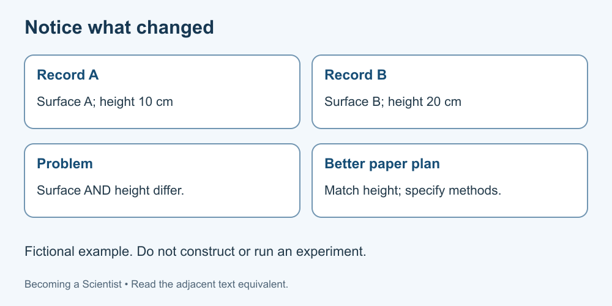

# 5. Fair comparisons and confounding

[Course home](../README.md) · [Glossary](../GLOSSARY.md)

**Goal:** Identify what changes and what else could explain a difference.

Adults 18+. All named people, examples, role cards and datasets are fictional. Use paper or an accessible equivalent; a calculator is optional.

## Understand

In a simple comparison, identify the factor being varied, the outcome recorded and other conditions that should be comparable. Science Buddies calls these independent, dependent and controlled variables in its introductory experiment guidance. More complex research designs exist; this is an introductory model, not a rule that all science has one variable.

A confounding factor changes alongside the factor of interest in a way that prevents a clear explanation of the outcome. A comparison group alone does not fix that problem. Matching conditions and suitable assignment methods help address bias, but no short checklist guarantees a causal conclusion.

An association describes a pattern between variables. To claim causation, the design and wider evidence must address alternative explanations. This course does not perform a causal analysis.

Text equivalent: A and B differ in both surface and height; a proposed matched-height comparison still needs other methods specified.

## Worked example

Fictional paper records: surface A was tested from a 10 cm starting height; surface B from 20 cm. B travelled farther. Surface and starting height changed together, so this comparison cannot isolate the surface effect.

## Practise

Propose a better paper design for comparing the two surfaces. List the factor of interest, recorded outcome and three conditions to keep comparable. Do not build a ramp.

## Suggested reasoning

Factor: surface label. Outcome: travel distance. Comparable conditions could include starting height, object and release method. Also specify measurement and repeated observations; consider order and other conditions. These choices improve the proposed comparison but do not prove an effect.

## Try a new situation

Fictional records show more umbrellas and more wet pavements on the same days. Does that prove umbrellas wet the pavement? Check: another factor, such as rain, could relate to both. A pattern alone does not identify its cause.

[Sources and limits](../SOURCES.md) · [Next lesson](06-patterns.md) · [Reuse](../LICENSE.md)
